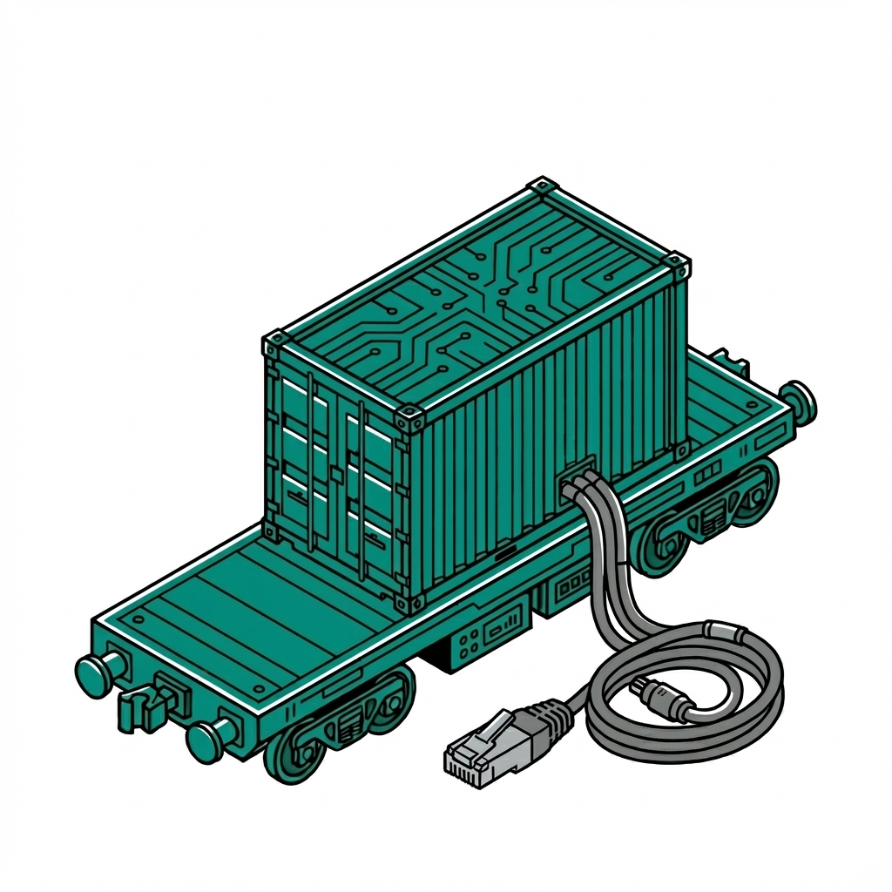

# Flatcar Kubernetes Homelab

Welcome to the **Flatcar Homelab** project. This repository contains the configuration and automation for a fully automated, GitOps-driven Kubernetes cluster on bare metal, leveraging Flatcar Container Linux and Kubeadm.

## Core Concepts

* **Immutable Infrastructure**: Uses Flatcar Container Linux for secure, auto-updating nodes.
* **GitOps**: All cluster state is managed via ArgoCD.
* **Networking**: Cilium for CNI, Gateway API, and WireGuard encryption.
* **Storage**: Rook-Ceph for distributed block storage.

## Documentation

The full project documentation is hosted at **[https://docs.k8s.wlkr.ch](https://docs.k8s.wlkr.ch)**.

* **[Quickstart Guide](https://docs.k8s.wlkr.ch/quickstart)**: Instructions for bootstrapping the cluster.
* **[Platform Architecture](https://docs.k8s.wlkr.ch/platform/)**: details on core infrastructure components.
* **[Workloads](https://docs.k8s.wlkr.ch/workloads/)**: Information about deployed applications.

## Repository Structure

* `ansible/`: Ansible playbooks for bootstrapping and configuration generation.
* `boot_server/`: Python-based PXE boot server.
* `payload/`: The "GitOps Payload" containing ArgoCD Applications and Kubernetes manifests.
  * `platform/`: Core infrastructure (Cilium, Rook, etc.).
  * `workloads/`: User applications (Home Assistant, etc.).
  * `argocd/`: ArgoCD bootstrap configuration.

## Contributing

See the `development/` directory in the documentation for contribution guidelines and development workflows.
