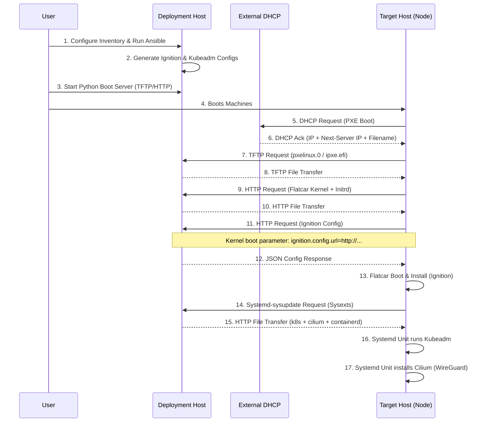
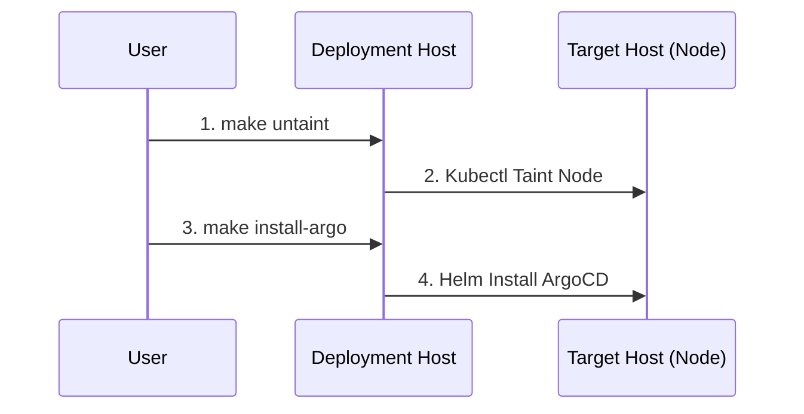

# Architecture

This project provides a mechanism to deploy a Bare Metal Kubernetes Cluster using Flatcar Container Linux and Kubeadm.

## Components

### 1. Deployment Host (Local Machine)

The machine where this project is executed.

* **Ansible**: Responsible for generating the configuration files (Ignition, Kubeadm config) based on templates and variables.
* **Python Boot Server**: A custom Python script that runs:
  * **TFTP Server**: Serves the Bootloader (syslinux.efi/pxelinux.0) and config.
  * **HTTP Server**: Serves Ignition configs, Flatcar Kernel/Initrd, and Sysext images (`.raw`) + configs (`.conf`).
* **Artifacts**: Directory containing downloaded OS images (Flatcar) and generated configs.

### 2. Target Host (Bare Metal Node)

The physical machine to be provisioned.

* **PXE Client**: NIC boots via network (DHCP provided externally).
* **Flatcar OS**: The operating system loaded into RAM and then installed to disk.
* **Kubeadm**: The tool used to bootstrap the Kubernetes cluster.

## Interfaces & Data Flow



### Post-Installation Flow



## Directory Structure

```text
.
├── ansible
│   ├── inventory.yml       # Host definitions (MAC addresses, IPs, Roles)
│   ├── playbooks
│   │   ├── download.yml    # Orchestrate downloads
│   │   ├── tasks           # Download Task definitions
│   │   │   ├── download_flatcar.yml
│   │   │   ├── download_sysext.yml
│   │   │   └── download_syslinux.yml
│   │   └── config.yml      # Generate configs
│   └── templates
│       ├── butane_config.yaml.j2 # Butane config template (transpiles to Ignition)
│       └── kubeadm.yaml.j2
├── boot_server
│   └── serve.py            # Python script for HTTP & TFTP
├── output                  # Generated files & Artifacts
│   ├── credentials         # Security artifacts (Kubeadm tokens, Certificate Keys)
│   ├── http                # Ignition configs, Flatcar artifacts, Sysext images (served via HTTP)
│   ├── kubeconfig          # Admin Kubeconfig file (generated after cluster is ready)
│   ├── tftp                # PXE bootloader & configs (served via TFTP)
│   └── tmp                 # Temporary download/extraction workspace
│       ├── butane          # Generated Butane YAMLs
│       ├── kubeadm         # Generated Kubeadm server configurations (for debugging)
│       └── syslinux        # Extracted Syslinux files
├── payload                 # K8s Manifests & Bootstrap scripts
│   ├── apps                # ArgoCD Applications
│   ├── bootstrap           # Initial cluster bootstrap resources (ArgoCD)
│   └── core                # Core infrastructure manifests
└── README.md
```

## Technologies

* **OS**: Flatcar Container Linux
* **Orchestrator**: Kubernetes (via Kubeadm)
* **Config Gen**: Ansible (Jinja2 templates)
* **Serving**: Python (Standard Library + `tftpy`)
