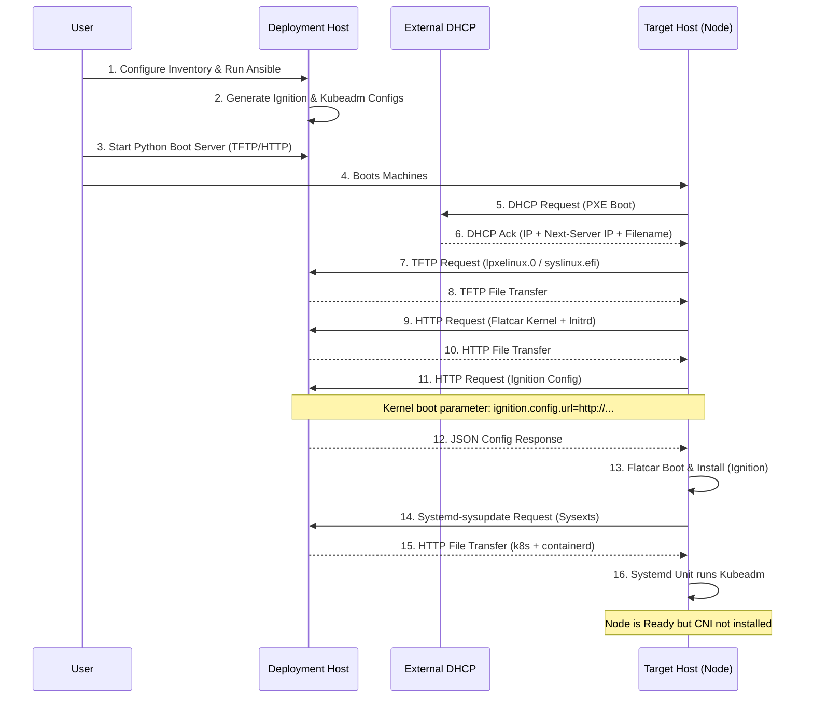
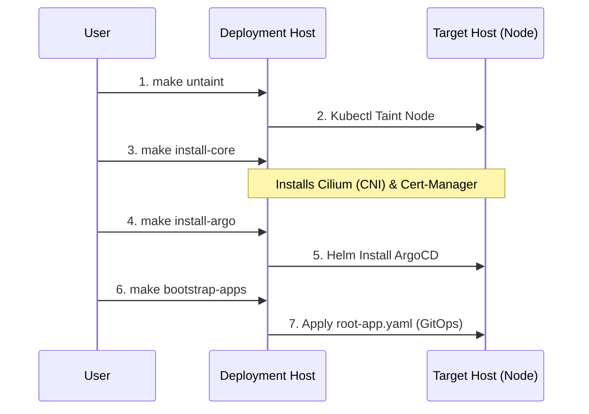

# Architecture

This project provides a mechanism to deploy a Bare Metal Kubernetes Cluster using Flatcar Container Linux and Kubeadm.

## Components

### 1. Deployment Host (Local Machine)

The machine where this project is executed.

* **Ansible**: Responsible for generating the configuration files (Ignition, Kubeadm config) based on templates and variables.
* **Python Boot Server**: A custom Python script that runs:
  * **TFTP Server**: Serves the Bootloader (syslinux.efi/lpxelinux.0) and config.
  * **HTTP Server**: Serves Ignition configs, Flatcar Kernel/Initrd, and Sysext images (`.raw`) + configs (`.conf`).
* **Artifacts**: Directory containing downloaded OS images (Flatcar) and generated configs.

### 2. Target Host (Bare Metal Node)

The physical machine to be provisioned.

* **PXE Client**: NIC boots via network (DHCP provided externally).
* **Flatcar OS**: The operating system loaded into RAM and then installed to disk.
* **Kubeadm**: The tool used to bootstrap the Kubernetes cluster.

## Interfaces & Data Flow



### Post-Installation Flow



## Directory Structure

```text
.
├── ansible
│   ├── inventory.yml       # Host definitions (MAC addresses, IPs, Roles)
│   ├── playbooks
│   │   ├── config.yml      # Generate configs
│   │   ├── download.yml    # Orchestrate downloads
│   │   ├── kubeconfig.yml  # Retrieve kubeconfig from control plane
│   │   └── tasks           # Download Task definitions
│   │       ├── download_flatcar.yml
│   │       ├── download_sysext.yml
│   │       └── download_syslinux.yml
│   └── templates
│       ├── butane_config.yaml.j2 # Butane config template (transpiles to Ignition)
│       ├── kubeadm.yaml.j2
│       └── pxe_config.j2         # PXE boot menu config
├── boot_server
│   └── serve.py            # Python script for HTTP & TFTP
├── output                  # Generated files & Artifacts
│   ├── credentials/        # Security artifacts
│   ├── http/               # Ignition, Flatcar artifacts, Sysext images
│   ├── kubeconfig          # Admin Kubeconfig file
│   ├── tftp/               # PXE bootloader & configs
│   └── tmp/                # Temporary workspace
├── payload                 # K8s Manifests & Bootstrap scripts
│   ├── root-app.yaml       # The "App of Apps" entry point
│   ├── apps/               # ArgoCD Applications
│   │   └── nginx-test/     # User app directory
│   │       ├── application.yaml
│   │       ├── deployment.yaml
│   │       ├── httproute.yaml
│   │       ├── namespace.yaml
│   │       └── service.yaml
│   ├── argocd/             # ArgoCD config (managed by ArgoCD after bootstrap)
│   │   ├── application.yaml     # ArgoCD self-management Application
│   │   ├── argocd-values.yaml
│   │   └── argocd-httproute.yaml
│   └── core/               # Infrastructure managed by ArgoCD
│       ├── cert-manager/   # TLS certificates
│       ├── cilium/         # CNI + Gateway API
│       ├── gateway-api/    # Gateway resources
│       ├── monitoring/     # Prometheus stack
│       └── rook-ceph/      # Storage operator & cluster
└── README.md
```

## Technologies

* **OS**: Flatcar Container Linux
* **Orchestrator**: Kubernetes (via Kubeadm)
* **CNI/Ingress**: Cilium (ebpf-based, kube-proxy replacement)
* **GitOps**: ArgoCD (App-of-Apps pattern)
* **Storage**: Rook-Ceph (persistent RBD block storage)
* **Config Gen**: Ansible (Jinja2 templates)
* **Serving**: Python (Standard Library + `tftpy`)
