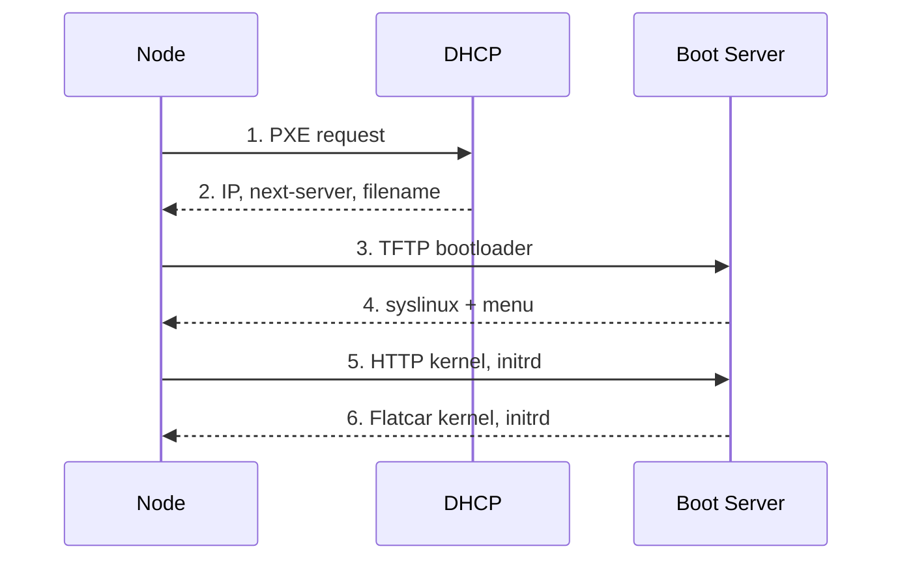
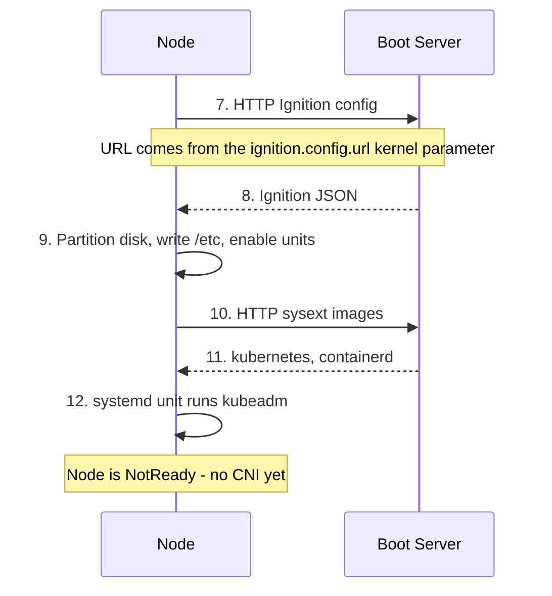
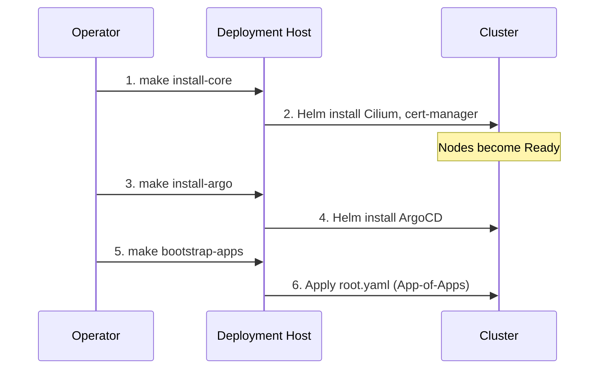

# Boot & Bootstrap Process

This page follows a single node from the moment you press the power button to
the moment it shows up in `kubectl get nodes`. Understanding this sequence is
what turns a stalled PXE boot from a mystery into a question with an obvious
next step: *which arrow didn't happen?*

## 1. Preparation (on the deployment host)

Before any node is powered on, the operator runs `make config` to generate the
per-host Ignition and PXE configs, then `make serve` to start the TFTP and HTTP
servers. See the [Quickstart](../quickstart.md) for the exact sequence.

## 2. Network Boot

The DHCP server is external to this project. It must hand out the boot server's
IP as `next-server` and a syslinux filename — see the
[Quickstart prerequisites](../quickstart.md#prerequisites).

Step 2 is where most first attempts die, and it dies silently: the node asks,
nothing useful answers, and the firmware moves on to the next boot device
without a word of complaint.

## 3. Install & Bootstrap

Step 9 is the point of no return for the *disk*: Ignition repartitions
`install_disk` without asking twice, and whatever was on that machine before is
now a memory. Check `install_disk` before you check anything else.

Step 12 leaving the node `NotReady` is correct and expected — there is no CNI
yet, so the kubelet has nothing to plug pods into. It stays that way until
`make install-core` lands Cilium.

## Nothing is installed to disk

This is the single most surprising property of these nodes, and it is easy to
miss because every other PXE guide on the internet ends with `flatcar-install`.
This one does not call it.

The PXE menu boots `flatcar_production_pxe_image.cpio.gz` — the RAM image — and
passes `flatcar.first_boot=1` on every boot, not just the first. So:

| | |
| --- | --- |
| `/` | **tmpfs.** 3.8 GB on the control-plane nodes, 7.7 GB on `freya` |
| Ignition | Runs on **every** boot, re-fetching its config from the boot server |
| `/etc/kubernetes`, `/var/lib/etcd`, `/var/lib/rook` | In RAM; gone at reboot |
| Persisted on disk | Only the partitions Ignition creates — and those are reformatted at each boot too |

A reboot is therefore a **reprovision**. `bootstrap-k8s.service` fires because
its `ConditionPathExists=!/etc/kubernetes/kubelet.conf` is satisfied again, and
the node re-runs `kubeadm init` or `kubeadm join` from scratch. The cluster
survives this the same way it survives a node failure: the other two
control-plane nodes hold etcd quorum, and Rook rebuilds from the `rook-osd`
partition, which is the one thing Ignition leaves alone.

!!! danger "A node cannot reboot unless the boot server is running"
    The kernel, the initrd and the Ignition config all come from `make serve`. Without it a rebooting node PXE-boots into nothing, falls through to a disk that holds no bootloader, and stays down — and [Kured](../platform/kured.md) reboots nodes automatically between 01:00 and 05:00. Run `make serve` before anything triggers a reboot, and treat "stop the boot server when provisioning is finished" as advice for the window between builds rather than a steady state. See [Nodes cannot boot without the boot server](limitations.md#nodes-cannot-boot-without-the-boot-server).

## 4. Post-Installation Bootstrap

Once Kubeadm has initialized the control plane, the remaining components are
installed from the deployment host. This is the last time anything is applied by
hand; after step 6 the repository is in charge.

!!! note
    `make untaint` is **not** part of this flow. It removes the control-plane `NoSchedule` taint and applies only to a single-node cluster. The layout in [Architecture Overview](index.md#cluster-layout) has dedicated workers, so the taint should stay in place — an untainted control plane is a control plane that will one day be evicted by a Helm chart with ambitious resource requests. On a single node it is not optional and it goes *before* step 1: cert-manager has no tolerations, so `make install-core` hangs waiting on pods that cannot be scheduled. See [Single-node clusters](../quickstart.md#single-node-clusters).
