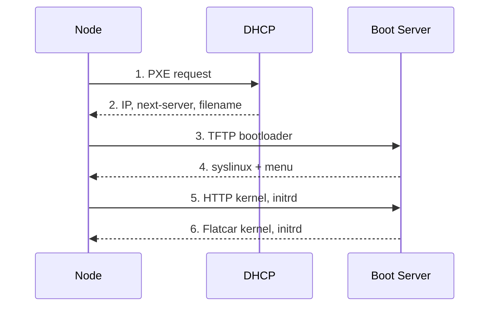
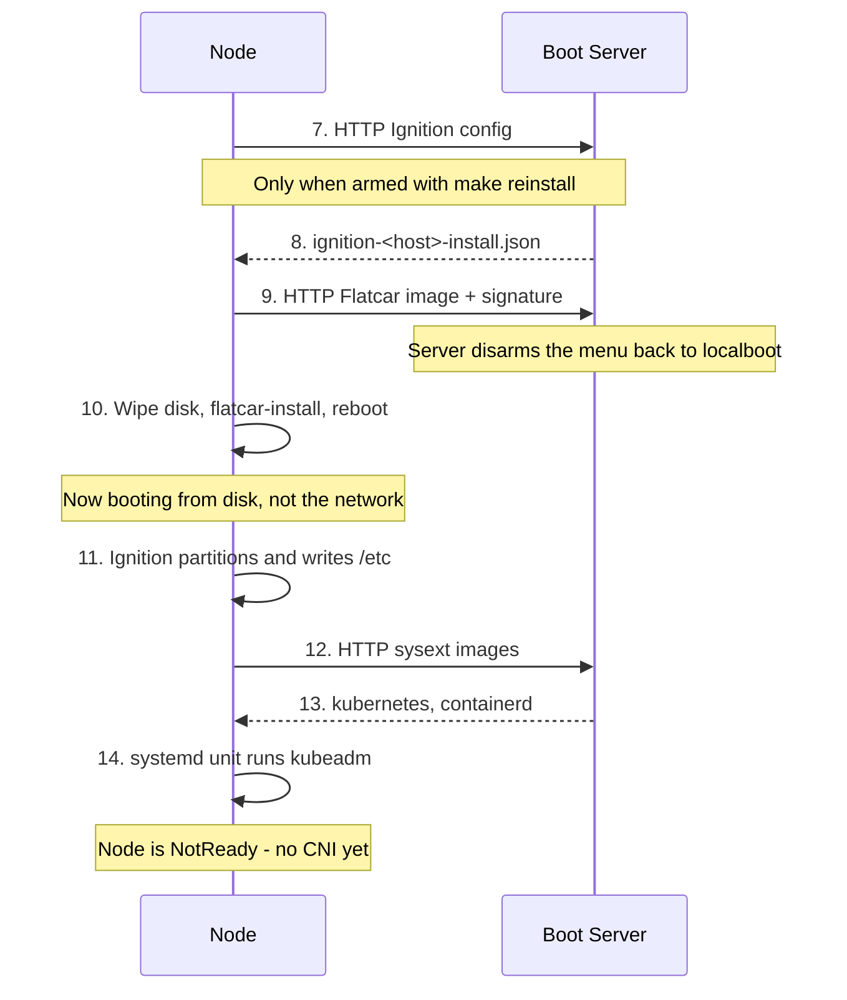
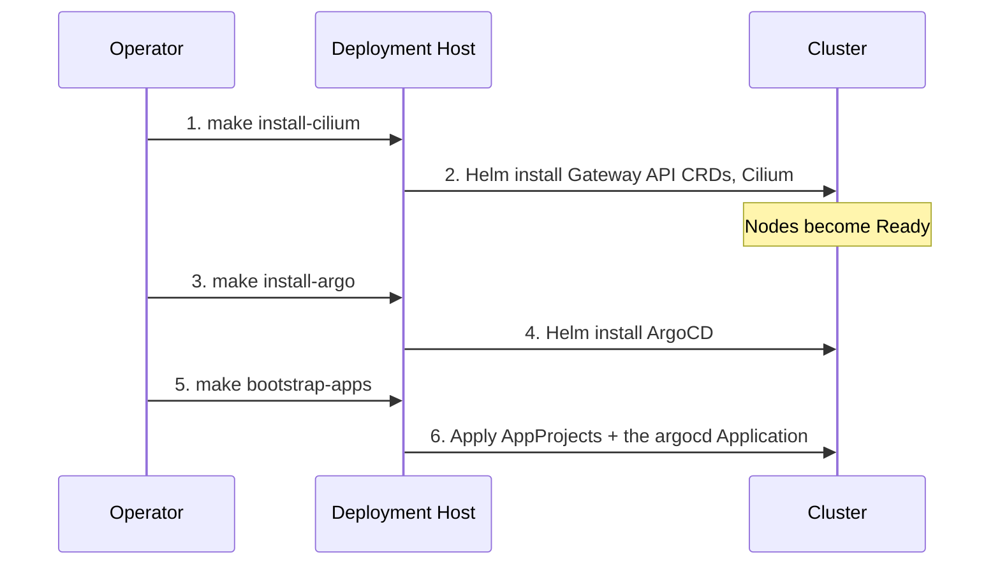

# Boot & Bootstrap Process

One node from the power button to `kubectl get nodes`. When an install stalls,
the question is *which arrow did not happen?*

## 1. Preparation (on the deployment host)

`make config` generates the per-host Ignition and PXE configs; `make serve`
starts the [boot server](#boot-server). The [Quickstart](../quickstart.md) has
the exact sequence.

## 2. Network Boot



The DHCP server is external and must hand out the boot server's IP as
`next-server` and a syslinux filename — see the
[Quickstart prerequisites](../quickstart.md#prerequisites). Step 2 is where most
first attempts die, silently: the firmware moves on to the next boot device.

## 3. Install & Bootstrap

PXE boots the **installer**, and only on a node armed with `make reinstall`;
the generated menu otherwise says `DEFAULT localboot`. The installer is a RAM
environment whose only job is to write Flatcar to `install_disk` and reboot
into it. Two templates, because two machines share a disk and nothing else:

| Template | Renders to | Runs in | `wipe_table` |
| --- | --- | --- | --- |
| `butane_installer_config.yaml.j2` | `ignition-<host>-install.json` | the PXE environment | `true` |
| `butane_node_config.yaml.j2` | `ignition-<host>.json` | the installed system, first boot | `false` |

The PXE menu points at the first. The installer fetches the second as a plain
file and hands it to `flatcar-install -i`, which embeds it in the OEM partition
of the system it writes.

!!! tip "Keep the installer minimal"
    Anything in `butane_installer_config.yaml.j2` is downloaded into RAM on every install of every node and discarded ninety seconds later. If it configures the node rather than the installation, it belongs in `butane_node_config.yaml.j2`.



Between steps 9 and 10 the boot server rewrites the node's menu to
`DEFAULT localboot` — see
[Switching back to local boot](#switching-back-to-local-boot). From step 11 the
node runs from disk and needs the boot server only for the sysexts in step 12,
on this first boot. `NotReady` after step 14 is expected: there is no CNI until
`make install-cilium`.

### Wiping the disk

Step 10 is the point of no return, and the wipe has three parts:

| Wipe | Where | What it does |
| --- | --- | --- |
| `wipe_table: true` | `ignition-<host>-install.json` only | Destroys the GPT before the installer runs, so partition numbers and offsets come out the same whether the disk was empty or held the last cluster. Without it a rebuild inherits the old layout and `ignition-disks.service` fails on an `sgdisk` overlap |
| `blkdiscard` | installer | Returns the device to unwritten. Best-effort: SATA without TRIM declines |
| `format: none` on `rook-osd` | `butane_node_config.yaml.j2` | Erases the old BlueStore signature, which `ceph-volume` reads instead of the partition table; a repartition alone can resurrect an OSD from a previous cluster |

The installed system's config must not wipe: Ignition refuses to touch the disk
it booted from (`refusing to wipe active disk`) and the first boot fails before
anything is written. `storage.filesystems` follows the same split — `rook-osd`
does not exist in the installer, and Ignition would block waiting for it.

Check `install_disk` before you check anything else.

### Boot order

The install leaves the firmware's boot order alone (`flatcar-install -u`, which
would put the disk at the front of `BootOrder`, is not passed). The nodes
network-boot first and reach their disk through `LOCALBOOT`, so the generated
menu decides every boot; a disk promoted ahead of PXE would make
`make reinstall` rewrite a menu the firmware no longer reads. A node therefore
needs network boot first with a working `LOCALBOOT`, or the disk ahead of PXE
in the firmware — with neither it installs and then has nothing to boot.

## 4. Post-Installation Bootstrap

Once kubeadm has initialised the control plane, `make bootstrap` installs only
what ArgoCD needs to run, and ArgoCD itself. After step 6 the repository is in
charge.



!!! note "`make untaint` is not part of this flow"
    It removes the control-plane `NoSchedule` taint and applies only to a single-node cluster, where it goes *before* step 3 — ArgoCD has no tolerations. The [documented layout](index.md#cluster-layout) has dedicated workers, so the taint stays. See [Single-node clusters](../quickstart.md#single-node-clusters).

## Every boot after the first

The node boots from its own disk; the boot server should be off.

| | |
| --- | --- |
| `/` | ext4 on partition 9, capped at 50 GB and grown into it by `grow-root.service` |
| Ignition | Runs **once**, on the first boot after the install |
| `/etc/kubernetes`, `/var/lib/etcd`, `/var/lib/rook` | On disk; survive a reboot |
| `rook-osd` | Partition 10, raw and unmounted — Ceph owns it |

`bootstrap-k8s.service` does not fire again: its
`ConditionPathExists=!/etc/kubernetes/kubelet.conf` is no longer satisfied.

!!! note "Why `grow-root.service` exists"
    Taking partition 9 over in Ignition stops Flatcar's stock `systemd-growfs-root.service`: it is pulled in by an `x-systemd.growfs` mount option that a root mounted from `root=LABEL=ROOT` does not carry. Without the unit the node keeps the image's ~1.6 GB filesystem inside a 50 GB partition. It runs the same binary and is a no-op once the filesystem fills the partition.

!!! note "Two boot paths, and the menu picks the safe one"
    `PROMPT 0` boots whatever `DEFAULT` names, and the template always emits `DEFAULT localboot`, so a node that network-boots for any reason lands on its own disk. `make reinstall` rewrites that one line to arm it; see [Rebuilding or repartitioning a node](../operations/nodes.md#rebuilding-or-repartitioning-a-node). Holding Shift or Alt at boot forces the prompt, the escape hatch for a node armed by mistake.

## Boot server

`boot_server/serve.py` is a TFTP server and an HTTP server. `make serve` starts
it from the repository root (the document roots are relative to the working
directory) and needs `sudo` for port 69; once both ports are bound it drops
back to the user who ran `sudo`, so nothing under `output/` ends up owned by
root. Both servers bind `boot_server_ip`
from `ansible/inventory.yaml` — the address `make config` baked into every
generated URL — and nothing else. If no interface holds that address it says so
and names the variable; if port 8000 is taken it exits.

| Server | Root | Serves |
| --- | --- | --- |
| TFTP, port 69 | `output/tftp` | `lpxelinux.0` (BIOS) or `syslinux.efi` (UEFI), and the menus in `pxelinux.cfg/` |
| HTTP, port 8000 | `output/http` | Kernel, initrd, OS image and signature, Ignition configs, sysext images. No directory listings |

Both roots are written by `make config` and `make download`; a missing file is
fixed by `make artifacts`, not by the script.

Leave it in the foreground. It opens by naming what it serves and which nodes
are armed — a boxed warning listing every disk about to be wiped, with
`make reinstall-cancel` and its `LIMIT=<node>` form — then logs one line per
request against the node that made it. The file a node *stops* at is the
diagnosis; see
[Troubleshooting PXE boot](../quickstart.md#troubleshooting-pxe-boot).

```console
20:33:04  server        http on 10.9.200.222:8000 from output/http
20:33:04  server        tftp on 10.9.200.222:69 from output/tftp
20:33:04  server        armed to install: odin, thor
20:33:04  server        booting from disk: freya, heimdall, loki, valkyrie
20:34:17  odin          collecting the bootloader (lpxelinux.0)
20:34:17  odin          collecting its boot menu -- armed, so it will install
20:34:19  odin          collecting the kernel
20:34:21  odin          collecting the initrd (391.2 MB)
20:34:48  odin          collecting its Ignition config
20:34:48  odin          collecting the OS image (1.2 GB) -- this is the long one
20:36:12  odin          OS image delivered -- switching to local boot, so the reboot lands on the disk
20:38:40  odin          collecting the kubernetes sysext (61.4 MB)
```

A node is identified by MAC from the `01-<mac>` menu it fetches, and after the
install by name from the `ignition-<host>.json` it asks for. A request from an
address that has done neither is logged against the bare IP.

## Switching back to local boot

`make reinstall` writes `DEFAULT install` into a node's menu and nothing in the
generated files writes it back, so firmware that network-boots first would
reinstall forever. The boot server therefore disarms the node the moment it has
delivered the whole OS image — the same edit `make reinstall-cancel` makes. A
node that never fetched an Ignition config cannot be identified by name; the
server says so and tells you to run `make reinstall-cancel` yourself.

Arming survives the boot server, because the menu is a file on disk. `Ctrl-C`
therefore checks: if anything is still armed it offers
`Disarm 2 node(s) now? [Y/n]`. Enter accepts; anything else leaves them armed
and repeats the cancel command. Without a terminal on stdin it warns and leaves
them armed.

!!! warning "It disarms on delivery, not on success"
    The server sees a transfer complete, not whether `flatcar-install` then wrote the disk. An install that fails after the download leaves a disarmed node with no working disk — loud, because `flatcar-install.service` does not reboot on failure — and the fix is `make reinstall LIMIT=<node>` before the power cycle.

!!! warning "Stop it when you are done"
    While it runs, anything on the segment can fetch the Ignition configs, which embed the kubeadm bootstrap token and certificate key — together enough to join a control-plane node. The token expires in 24 hours and the certificate key in two; the real mitigation is not leaving it running, and nothing needs it after a build. See [Security Posture](security.md#provisioning).
