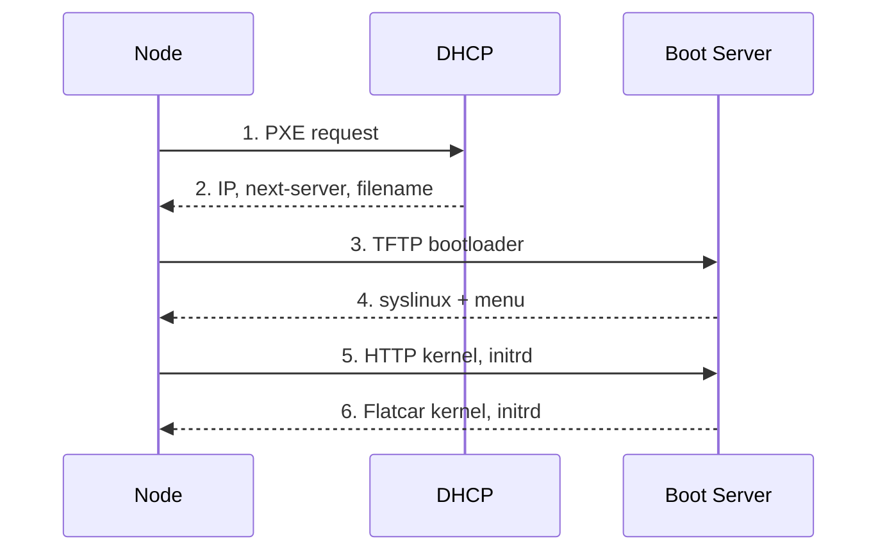
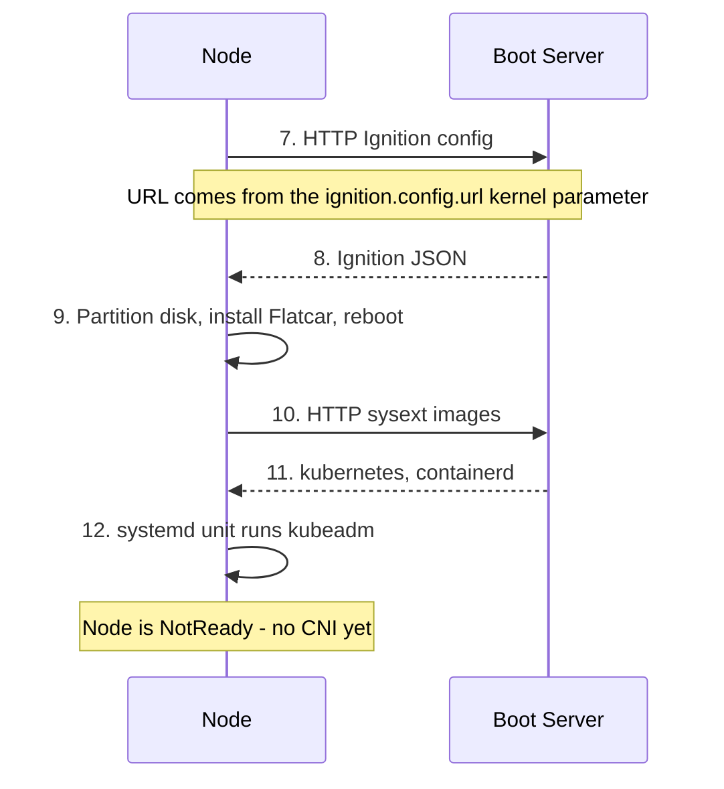
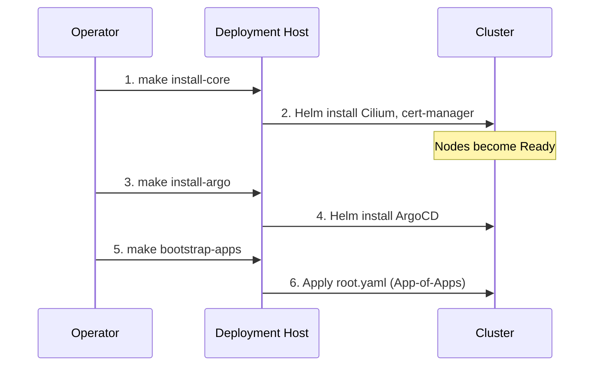

# Boot & Bootstrap Process

This document details the flow of data from the initial PXE boot to a fully
operational Kubernetes node.

## 1. Preparation (on the deployment host)

Before any node is powered on, the operator runs `make config` to generate the
per-host Ignition and PXE configs, then `make serve` to start the TFTP and HTTP
servers. See the [Quickstart](../quickstart.md) for the exact sequence.

## 2. Network Boot

The DHCP server is external to this project. It must hand out the boot server's
IP as `next-server` and a syslinux filename — see the
[Quickstart prerequisites](../quickstart.md#prerequisites).

## 3. Install & Bootstrap

## 4. Post-Installation Bootstrap

Once Kubeadm has initialized the control plane, the remaining components are
installed from the deployment host.

!!! note
    `make untaint` is **not** part of this flow. It removes the control-plane
    `NoSchedule` taint and applies only to a single-node cluster. The layout in
    [Architecture Overview](index.md#cluster-layout) has dedicated workers, so
    the taint should stay in place.
