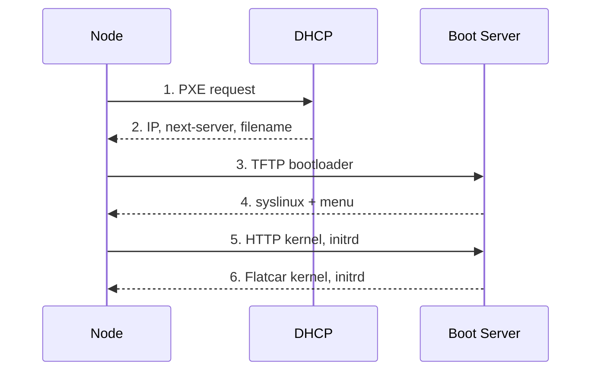
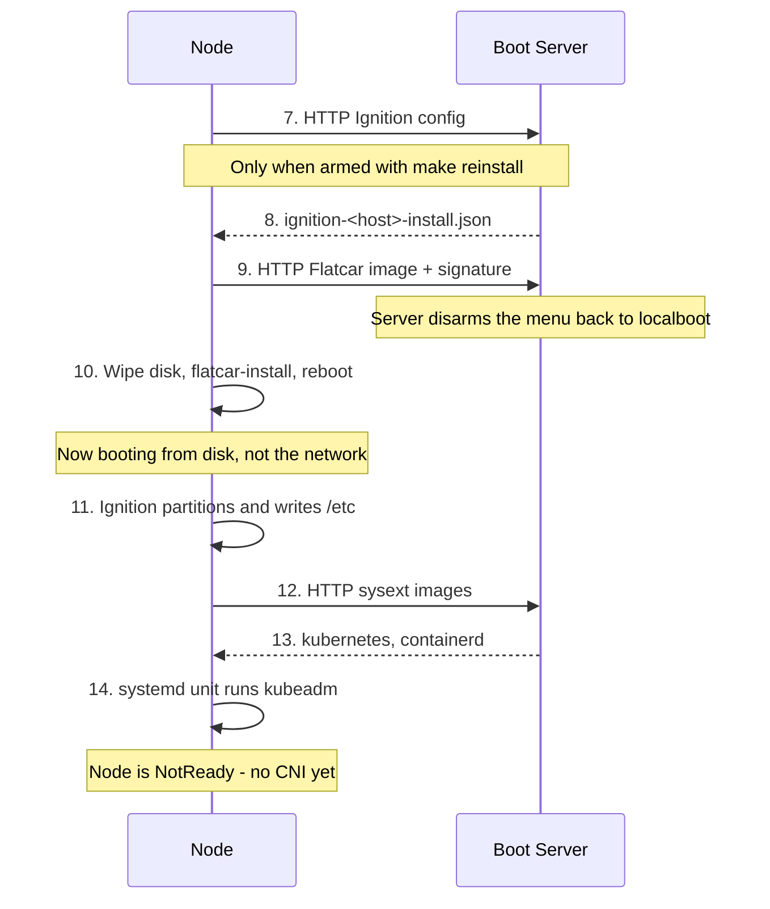
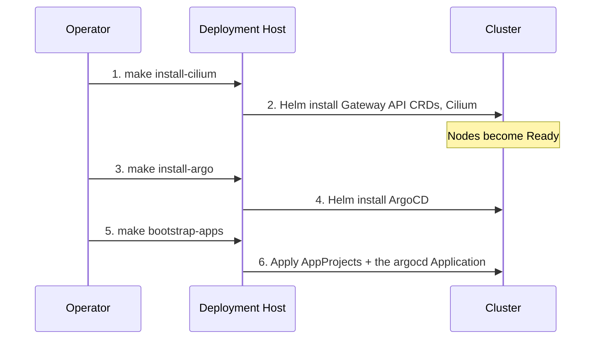

# Boot & Bootstrap Process

This page follows a single node from the moment you press the power button to
the moment it shows up in `kubectl get nodes`. Understanding this sequence is
what turns a stalled PXE boot from a mystery into a question with an obvious
next step: *which arrow didn't happen?*

## 1. Preparation (on the deployment host)

Before any node is powered on, the operator runs `make config` to generate the
per-host Ignition and PXE configs, then `make serve` to start the TFTP and HTTP
servers. See the [Quickstart](../quickstart.md) for the exact sequence.

## 2. Network Boot



The DHCP server is external to this project. It must hand out the boot server's
IP as `next-server` and a syslinux filename — see the
[Quickstart prerequisites](../quickstart.md#prerequisites).

Step 2 is where most first attempts die, and it dies silently: the node asks,
nothing useful answers, and the firmware moves on to the next boot device
without a word of complaint.

## 3. Install & Bootstrap

PXE does not boot the node; it boots the **installer** — and only when the node
has been armed with `make reinstall`, since the generated config otherwise says
`DEFAULT localboot`. What it loads is a RAM environment whose only job is to
write Flatcar to `install_disk` and reboot into it.

There are **two templates, because there are two machines**. The RAM
environment and the node it installs share a disk and nothing else, and
pretending otherwise is what made every failure in this page's troubleshooting
possible.

| | renders to | runs in |
| --- | --- | --- |
| `butane_installer_config.yaml.j2` | `ignition-<host>-install.json` | the PXE environment |
| `butane_node_config.yaml.j2` | `ignition-<host>.json` | the installed system, on first boot |

The PXE menu points at the first. The installer fetches the second as a plain
file and hands it to `flatcar-install -i`, which embeds it in the OEM partition
of the system it writes — so the node's own config is delivered *by* the
installer without ever being executed in it.

The installer config is deliberately small: an SSH key, `wipe_table: true`, the
one file to hand onward, and the two `flatcar-install` units. Everything it does
not contain is downloaded into a RAM disk and discarded ninety seconds later —
which used to include 144 MiB of sysext images the installer had no use for.

!!! tip "Keep the installer minimal"
    Anything added to `butane_installer_config.yaml.j2` is paid for on every install of every node, in RAM and in download time, and thrown away. If it configures the node rather than the installation, it belongs in `butane_node_config.yaml.j2`.



Step 10 is the point of no return, and the wipe is deliberately in three parts
rather than one:

| | |
| --- | --- |
| Ignition `wipe_table` | Destroys the GPT, in the initramfs, before the installer unit runs. Only in `ignition-<host>-install.json` — see [Wiping the disk](#wiping-the-disk) |
| `blkdiscard` | Returns the whole device to unwritten. Best-effort — SATA without TRIM declines it |
| `format: none` on `rook-osd` | On the **installed** system's first boot, in `butane_node_config.yaml.j2` |

### Boot order

The install leaves the firmware's boot order alone. `flatcar-install` can write
a UEFI boot entry for the disk with `-u`, which is `efibootmgr -c` and puts that
entry at the front of `BootOrder`; this project does not pass it.

That is deliberate, because the boot order is the one thing the PXE menu cannot
override. These nodes are set to network boot first and reach their disk through
`LOCALBOOT`, so the generated menu decides what happens on every boot of every
node. An install that quietly promoted the disk ahead of PXE would take a node
out of that arrangement: `make reinstall` would rewrite a menu the firmware had
stopped reading, and the node would ignore it with no error anywhere.

The cost is that a node has to be able to reach its disk without that entry —
network boot first with a working `LOCALBOOT`, or the disk ahead of PXE in the
firmware. A machine with neither installs correctly and then has nothing to
boot.

### Wiping the disk

`wipe_table` is the one setting the two environments need opposite answers for,
and it is why there are two files rather than one.

In the **installer** it must be `true`. The disk is about to be overwritten
wholesale, so starting from a blank table is what makes an install reproducible:
partition numbers, offsets and sizes come out the same whether the disk was
empty or held the last cluster. With it `false`, a rebuild inherits the previous
layout — Ignition pins `rook-osd` to its old offset while growing `ROOT` over
it, and `ignition-disks.service` fails in the initramfs:

```console
sgdisk --delete=9 --delete=10 --new=9:12722176:+102400000 --new=10:65150976:+0
Could not create partition 9 from 12722176 to 115122175
```

The node drops to an emergency shell before `flatcar-install.service` ever runs,
so the disk is never touched. A node that has never been installed is
unaffected, which is why this only appears on a rebuild.

In the **installed system** it must be `false`, and Ignition will not do it
anyway. That config runs on the first boot from the disk it would be wiping, and
Ignition refuses by name — before reading the partition table, before running
`sgdisk`, about a millisecond into the stage:

```console
Ignition failed: create partitions failed: refusing to wipe active disk "/run/ignition/dev_aliases/dev/nvme0n1"
```

Which makes it the safer of the two mistakes: loud, and before anything is
written. The installer side has no such guard. A missing wipe there does not
announce itself — it surfaces as the `sgdisk` error above, about offsets you
have to work backwards from, and only on hardware that has been installed
before.

The tell that the two values have been collapsed into one is quieter still:
`resize: true` on `ROOT` stops mattering. With the table always wiped there is
never an existing partition to match, so the flag can never fire.

`storage.filesystems` follows the same split for the same reason. The installer
has just wiped the table, so `rook-osd` does not exist there, and asking Ignition
to prepare a filesystem on it blocks until it gives up:

```console
Ignition failed: failed to create filesystems: failed to wait on filesystems devs:
device unit dev-disk-by\x2dpartlabel-rook\x2dosd.device timeout
```

Erasing the previous cluster's BlueStore signature belongs on the installed
system regardless — that is where the partition is.

The third wipe is about Ceph specifically. BlueStore metadata lives at the start of
the raw `rook-osd` partition, and `ceph-volume` reads that *signature* rather
than the partition table — so a repartition alone can resurrect an OSD on a
cluster that has never heard of it. The partition is new; the bytes under it are
not, which is why the erase belongs where the partition is created.

Check `install_disk` before you check anything else.

Between steps 9 and 10 the boot server rewrites that node's menu back to
`DEFAULT localboot`. Nothing else would: `make reinstall` arms the menu and the
generated files never disarm it, so on firmware that network boots first the
reboot in step 10 would read the same armed menu and start the install over.
See [Boot Server &rarr; Switching back to local
boot](boot-server.md#switching-back-to-local-boot).

Step 11 runs from disk, not from the network. Ignition is embedded in the OEM
partition by `flatcar-install -i`, so the node no longer depends on the boot
server for its config — only for the sysext images in step 12, and only on this
first boot.

Step 14 leaving the node `NotReady` is correct and expected — there is no CNI
yet, so the kubelet has nothing to plug pods into. It stays that way until
`make install-cilium` lands Cilium.

## Every boot after the first

The node boots from its own disk. The boot server can be, and should be,
switched off.

| | |
| --- | --- |
| `/` | ext4 on partition 9, capped at 50 GB and grown into it by `grow-root.service` |
| Ignition | Runs **once**, on the first boot after the install |
| `/etc/kubernetes`, `/var/lib/etcd`, `/var/lib/rook` | On disk; survive a reboot |
| `rook-osd` | Partition 10, raw and unmounted — Ceph owns it |

A reboot is therefore just a reboot. `bootstrap-k8s.service` does *not* fire,
because its `ConditionPathExists=!/etc/kubernetes/kubelet.conf` is no longer
satisfied — the file is still there from last time. etcd comes back with its
data, Rook finds its OSD, and the kubelet rejoins a cluster it never left.

!!! note "Why `grow-root.service` exists"
    Flatcar grows its root filesystem on first boot, and taking partition 9 over in Ignition is precisely what stops that happening — the stock `systemd-growfs-root.service` is `static` and is pulled in by an `x-systemd.growfs` mount option, which a root mounted from `root=LABEL=ROOT` on the kernel command line does not carry. Without the unit, a node comes up with a 50 GB ROOT partition holding the image's original ~1.6 GB filesystem — about 1.2 GB free for everything the node writes. It runs the same binary the stock unit does, and is a no-op once the filesystem already fills the partition.

!!! note "Two boot paths, and the menu picks the safe one"
    Nothing is chosen at the console. `PROMPT 0` boots whatever `DEFAULT` names and shows no menu, and the template always emits `DEFAULT localboot` — so a node that network-boots for any reason ends up on its own disk, with no keyboard involved. Installing means arming it with `make reinstall`, which rewrites that one line in the generated file; see [Repartitioning the nodes](../operations/nodes.md#rebuilding-or-repartitioning-a-node). Holding Shift or Alt at boot still forces the prompt, which is the escape hatch for a node that is armed and should not be.

## 4. Post-Installation Bootstrap

Once Kubeadm has initialized the control plane, the remaining components are
installed from the deployment host — only what ArgoCD needs to run, and ArgoCD
itself. This is the last time anything is applied by hand; after step 6 the
repository is in charge. `make bootstrap` runs all three targets in order.



!!! note
    `make untaint` is **not** part of this flow. It removes the control-plane `NoSchedule` taint and applies only to a single-node cluster. The layout in [Architecture Overview](index.md#cluster-layout) has dedicated workers, so the taint should stay in place — an untainted control plane is a control plane that will one day be evicted by a Helm chart with ambitious resource requests. On a single node it is not optional and it goes *before* step 3: ArgoCD has no tolerations, so `make install-argo` waits on pods that cannot be scheduled. See [Single-node clusters](../quickstart.md#single-node-clusters).
