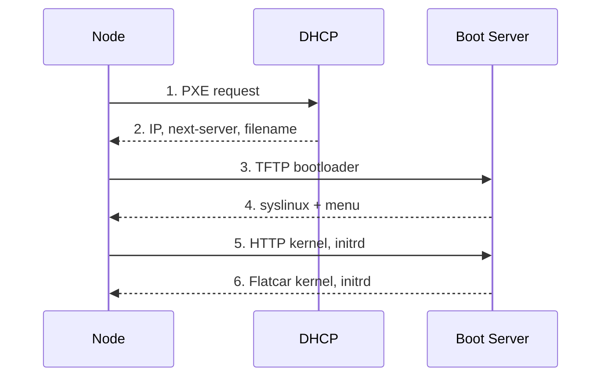
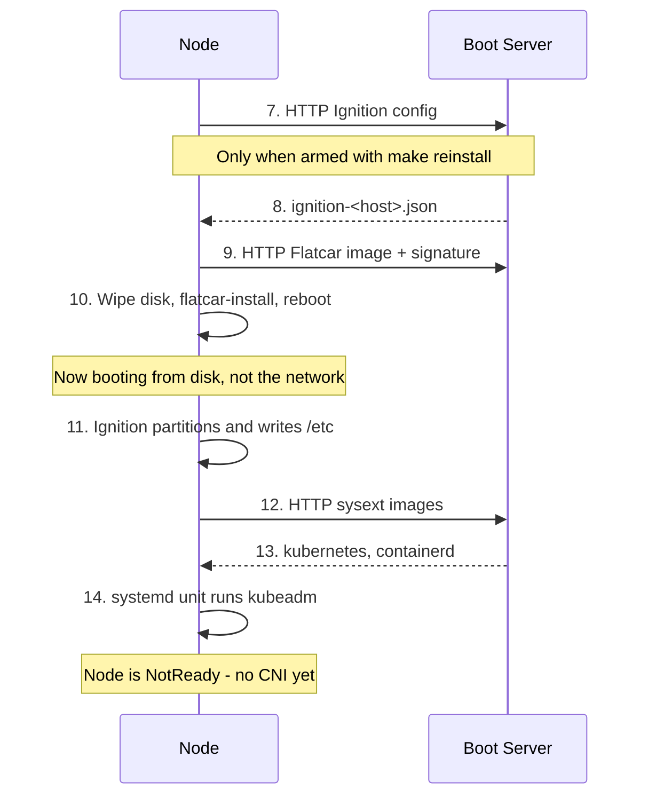
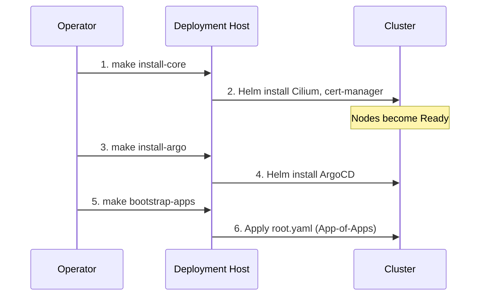

# Boot & Bootstrap Process

This page follows a single node from the moment you press the power button to
the moment it shows up in `kubectl get nodes`. Understanding this sequence is
what turns a stalled PXE boot from a mystery into a question with an obvious
next step: *which arrow didn't happen?*

## 1. Preparation (on the deployment host)

Before any node is powered on, the operator runs `make config` to generate the
per-host Ignition and PXE configs, then `make serve` to start the TFTP and HTTP
servers. See the [Quickstart](../quickstart.md) for the exact sequence.

## 2. Network Boot

The DHCP server is external to this project. It must hand out the boot server's
IP as `next-server` and a syslinux filename — see the
[Quickstart prerequisites](../quickstart.md#prerequisites).

Step 2 is where most first attempts die, and it dies silently: the node asks,
nothing useful answers, and the firmware moves on to the next boot device
without a word of complaint.

## 3. Install & Bootstrap

PXE does not boot the node; it boots the **installer** — and only when the node
has been armed with `make reinstall`, since the generated config otherwise says
`DEFAULT localboot`. What it loads is a RAM environment whose only job is to
write Flatcar to `install_disk` and reboot into it.

There is **one Ignition config per host**, and it does both jobs. The PXE
environment runs it to install; `flatcar-install -i` embeds the same file into
the system being installed, where it runs again on first boot to partition the
disk and lay down `/etc`. What separates the two is
`ConditionKernelCommandLine`: a PXE boot carries `ignition.config.url` on the
kernel command line and a disk boot does not, so each unit declares which side
it belongs on.

!!! warning "Every unit has to pick a side"
    That condition is the price of one config rather than two, and nothing enforces it. `bootstrap-k8s.service` is the cautionary one: its other guard is `ConditionPathExists=!/etc/kubernetes/kubelet.conf`, which is satisfied in the PXE environment too — unguarded, it would run `kubeadm` in a RAM disk while the install was still writing. A unit added without thinking about this fails quietly, and `systemctl status` reporting "Condition check resulted in the unit being skipped" is how you find out.

Step 10 is the point of no return, and the wipe is deliberately in three parts
rather than one:

| | |
| --- | --- |
| Ignition `wipe_table` | Destroys the GPT, in the initramfs, before the installer unit runs |
| `blkdiscard` | Returns the whole device to unwritten. Best-effort — SATA without TRIM declines it |
| `format: none` on `rook-osd` | On the **installed** system's first boot, in `butane_config.yaml.j2` |

The third is about Ceph specifically. BlueStore metadata lives at the start of
the raw `rook-osd` partition, and `ceph-volume` reads that *signature* rather
than the partition table — so a repartition alone can resurrect an OSD on a
cluster that has never heard of it. The partition is new; the bytes under it are
not, which is why the erase belongs where the partition is created.

Check `install_disk` before you check anything else.

Step 11 runs from disk, not from the network. Ignition is embedded in the OEM
partition by `flatcar-install -i`, so the node no longer depends on the boot
server for its config — only for the sysext images in step 12, and only on this
first boot.

Step 14 leaving the node `NotReady` is correct and expected — there is no CNI
yet, so the kubelet has nothing to plug pods into. It stays that way until
`make install-core` lands Cilium.

## Every boot after the first

The node boots from its own disk. The boot server can be, and should be,
switched off.

| | |
| --- | --- |
| `/` | ext4 on partition 9, capped at 125 GB and grown into it by `grow-root.service` |
| Ignition | Runs **once**, on the first boot after the install |
| `/etc/kubernetes`, `/var/lib/etcd`, `/var/lib/rook` | On disk; survive a reboot |
| `rook-osd` | Partition 10, raw and unmounted — Ceph owns it |

A reboot is therefore just a reboot. `bootstrap-k8s.service` does *not* fire,
because its `ConditionPathExists=!/etc/kubernetes/kubelet.conf` is no longer
satisfied — the file is still there from last time. etcd comes back with its
data, Rook finds its OSD, and the kubelet rejoins a cluster it never left.

!!! note "Why `grow-root.service` exists"
    Flatcar grows its root filesystem on first boot, and taking partition 9 over in Ignition is precisely what stops that happening — the stock `systemd-growfs-root.service` is `static` and is pulled in by an `x-systemd.growfs` mount option, which a root mounted from `root=LABEL=ROOT` on the kernel command line does not carry. Without the unit, a node comes up with a 125 GB ROOT partition holding the image's original ~1.6 GB filesystem — about 1.2 GB free for everything the node writes. It runs the same binary the stock unit does, and is a no-op once the filesystem already fills the partition.

!!! note "Two boot paths, and the menu picks the safe one"
    Nothing is chosen at the console. `PROMPT 0` boots whatever `DEFAULT` names and shows no menu, and the template always emits `DEFAULT localboot` — so a node that network-boots for any reason ends up on its own disk, with no keyboard involved. Installing means arming it with `make reinstall`, which rewrites that one line in the generated file; see [Repartitioning the nodes](../operations/index.md#repartitioning-the-nodes). On UEFI firmware `flatcar-install -u` writes a real boot entry, so the firmware usually goes straight to disk without reading this file at all; set the disk ahead of PXE in the boot order and it never will. Holding Shift or Alt at boot still forces the prompt, which is the escape hatch for a node that is armed and should not be.

## 4. Post-Installation Bootstrap

Once Kubeadm has initialized the control plane, the remaining components are
installed from the deployment host. This is the last time anything is applied by
hand; after step 6 the repository is in charge.

!!! note
    `make untaint` is **not** part of this flow. It removes the control-plane `NoSchedule` taint and applies only to a single-node cluster. The layout in [Architecture Overview](index.md#cluster-layout) has dedicated workers, so the taint should stay in place — an untainted control plane is a control plane that will one day be evicted by a Helm chart with ambitious resource requests. On a single node it is not optional and it goes *before* step 1: cert-manager has no tolerations, so `make install-core` hangs waiting on pods that cannot be scheduled. See [Single-node clusters](../quickstart.md#single-node-clusters).
