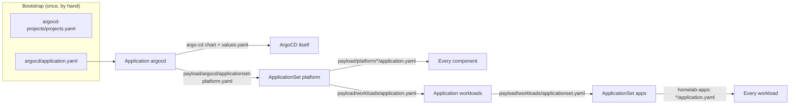

# GitOps Strategy

ArgoCD manages the cluster state declaratively: if it is not in Git, it is not
in the cluster, and if you put it there anyway the next reconcile puts it back.

## Structure



`argocd` is the only Application not generated by the ApplicationSet and the
only one applied by hand. It syncs the chart that runs ArgoCD and, through a
second source, the `platform` ApplicationSet, so changes to the generator
arrive through Git. Its chart values are described in
[Platform &rarr; ArgoCD](../platform/argocd.md), along with the recovery
commands for the day ArgoCD syncs a broken ArgoCD config.

Everything else is a component directory with one `application.yaml`,
including ArgoCD's own supporting resources:

| Application | Holds |
| --- | --- |
| `argocd-projects` | the `apps`, `infra` and `system` AppProjects |
| `argocd-config` | ArgoCD's HTTPRoute, OIDC `ExternalSecret` and Grafana dashboard |

The AppProjects cannot arrive through ArgoCD alone: an Application naming a
project that does not exist is rejected. `projects.yaml` is applied once at
bootstrap, ahead of the `argocd` Application that names `system`, and
`argocd-projects` adopts it on its first sync. A broken project definition is
fixed with `kubectl apply`, not a sync.

Each `application.yaml` is a complete Application, not a fragment: the
generator copies its labels, annotations, finalizers and `spec` unchanged, and
Renovate and the `Makefile` read it like any other manifest.

## Sync policy

Every Application, generated or not, carries the same `syncPolicy`: automated
sync with `prune` and `selfHeal`, and a `retry` block of ten attempts with a
backoff from 30s to 5m. That is the whole delivery contract:

- **A commit is live within one polling interval.** ArgoCD runs on a private
  address, so no GitHub webhook can reach it; the intervals are in
  [Platform &rarr; ArgoCD](../platform/argocd.md#configuration).
- **Drift is reverted.** A resource edited or deleted by hand is put back on
  the next reconcile, in the platform as much as in the workloads.
- **A failed sync retries itself.** ArgoCD never re-attempts a failed sync of
  the same revision unless the Application has a `retry` block, which is why
  every `application.yaml` carries one. The ten attempts span about forty
  minutes; after that the Application stays OutOfSync until its revision
  changes or it is synced by hand:

    ```bash
    argocd app sync <application>
    ```

- **Patching a generated Application's `spec` achieves nothing.** The next
  ApplicationSet reconcile copies the file back over it. That includes
  switching automated sync off: the only rollback is a revert commit — see
  [Rolling back a bad sync](../operations/troubleshooting.md#rolling-back-a-bad-sync).

## Bootstrap convergence

Nothing orders the Applications. On a fresh cluster the ApplicationSet
generates all of them at once and they converge on their own: a sync that
fails because a kind does not exist yet is retried once the chart that ships
it has landed, and a resource that applies but cannot go Ready waits without
failing anything. What each component waits for is in
[Platform &rarr; Rollout order](../platform/index.md#rollout-order).

| While it is missing | The dependent Application | Resolves when |
| --- | --- | --- |
| A CRD (`ServiceMonitor`, `HTTPRoute`, `ExternalSecret`, a Rook or CNPG kind) | fails its sync and retries | the chart shipping the CRD has synced |
| A `StorageClass` | is Progressing, its pods Pending | `rook-ceph-cluster` reports Ready |
| A working `ClusterSecretStore` | is Degraded on every `ExternalSecret` | OpenBao is unsealed and holds the key |
| A Gateway to attach to | is Progressing on every `HTTPRoute` | `gateway-api` holds its certificates |

Two placement rules keep this convergence short. **A resource lives with what
it needs, not with what it configures:** the `ClusterSecretStore` is in
`openbao`, not `external-secrets`, and cert-manager's issuers and certificates
are their own `certificates` Application, so the controllers report Healthy on
their own and the resources that wait for OpenBao are the ones that say so.
**A resource that fails to apply for longer than the retry budget belongs
elsewhere:** the budget covers a chart arriving minutes late, not a human
arriving hours late.

### Bootstrap pauses at OpenBao

A fresh cluster looks stuck at OpenBao, and that is the design. OpenBao's pods
report Ready while sealed, but the `ClusterSecretStore` beside it stays
Degraded until OpenBao is initialised, unsealed and has the Kubernetes auth
role, and with it every `ExternalSecret` in the platform. `make bao-init` and
`make bao-unseal` clear that;
`certificates` then waits for `make bao-secrets` to write the Route53
credentials, and the Gateways for the certificates. Nothing fails and nothing
times out: every one of those resources applied cleanly and is waiting on
status.

## Workloads live in a second repository

The applications the cluster exists to run are in
[`JanWelker/homelab-apps`](https://github.com/JanWelker/homelab-apps), one
directory per application; the `apps` ApplicationSet generates an Application
from each `*/application.yaml` there. The split keeps a platform change with a
cluster-wide blast radius apart from a workload change with a one-app one, and
keeps the reusable half of the cluster in a repository that could build
somebody else's.

The dependency runs one way: workloads reference the platform (the
`apps-gateway`, the `rook-ceph-block` StorageClass, the `openbao`
`ClusterSecretStore`, the CloudNativePG operator), and the platform references
the workloads repository exactly once — the `repoURL` in
`payload/workloads/applicationset.yaml`.

### What the split costs

- **Two repositories to clone**, and a change that spans both is two pull
  requests that cannot merge atomically; merge the platform half first.
- **The diff preview covers only this repository.** Both ApplicationSets carry
  `argocd-diff-preview/ignore` because the tool renders the repository it is
  given.
- **A workload can reference a platform resource that does not exist**, and
  nothing catches it until ArgoCD tries to sync.

### Workloads sync alongside the platform

The `apps` ApplicationSet ships inside the `workloads` Application, which the
`platform` ApplicationSet generates like any component. That is why
`payload/workloads/` is a sibling of `payload/platform/`, and why the
`platform` ApplicationSet names it as a second generator path rather than
a glob:

```yaml
        files:
          - path: payload/platform/*/application.yaml
          - path: payload/workloads/application.yaml
```

On a fresh cluster the workloads therefore start syncing before the platform
under them is Healthy, and converge the same way it does: a workload
`application.yaml` carries the same `retry` block, its `HTTPRoute` waits for
the `apps-gateway`, its volumes for Rook, its secrets for OpenBao. Ordering
*within* a workload uses resource-level sync waves — the CloudNativePG
`Cluster` is in an earlier wave, and ArgoCD's built-in health check for
`postgresql.cnpg.io/Cluster` waits for it before applying the application.

## Moving a resource to another Application

Moving a manifest between directories is not a move to ArgoCD: the old
Application sees a tracked resource vanish and, with `prune: true`, deletes
it; the new one recreates it, possibly seconds later. For a `ClusterSecretStore`
that is an outage of every secret; for a child `Application` with the resources
finalizer it deletes everything that Application deployed. A move takes two
merges:

1. Annotate the resource where it is, and let that sync:

    ```yaml
    annotations:
      argocd.argoproj.io/sync-options: Prune=false
      argocd.argoproj.io/compare-options: IgnoreExtraneous
    ```

    Both are read off the **live** object. `Prune=false` stops whichever
    Application prunes first; `IgnoreExtraneous` keeps the old Application
    Synced while it still sees the resource.
2. Move the file, keeping the annotations. The new Application takes over the
   tracking annotation.

The annotations can go once the second change has synced everywhere.

## Version pins

Each version is pinned once, in the `application.yaml` that owns the
component, and never anywhere else. The `Makefile` reads `targetRevision` out
of those manifests for the bootstrap installs (`make install-cilium`,
`make install-argo`), so what bootstrap installs is what ArgoCD then
reconciles. Renovate updates the same line; its automerge policy is in
[Maintenance](../development/maintenance.md).
