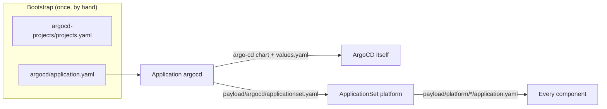

# GitOps Strategy

**ArgoCD** manages the cluster state declaratively. The rule is simple and
absolute: if it is not in Git, it is not in the cluster — and if you put it in
the cluster anyway, the next commit puts it back the way Git says. Not
immediately, for the platform: see [what staged rollouts
cost](#what-the-staging-costs).

This is not pedantry. It is the difference between a cluster you can rebuild
from a repository and a cluster held together by a series of `kubectl apply`
commands that exist only in one person's shell history.

## Structure

Two objects sit above the components: the `argocd` Application, and the
`platform` ApplicationSet it holds.



`argocd` is the only Application not generated by the ApplicationSet, and the
only one applied by hand. It syncs the chart that runs ArgoCD and, through a
second source, the ApplicationSet — so changes to the rollout arrive through
Git like anything else. It keeps `selfHeal`, which the generated Applications
give up under `RollingSync`, and its upgrades are not interleaved with a staged
platform rollout.

Everything else is a component directory with one `application.yaml`, including
ArgoCD's own supporting resources:

| Application | Stage | Holds |
| --- | --- | --- |
| `argocd-projects` | `00-projects` | the `apps`, `infra` and `system` AppProjects |
| `argocd-config` | `08-services` | ArgoCD's HTTPRoute, OIDC `ExternalSecret` and Grafana dashboard |

The AppProjects are the one thing that cannot arrive through ArgoCD alone: an
Application naming a project that does not exist is rejected, and the
ApplicationSet will not even create it. So `projects.yaml` is applied once at
bootstrap, ahead of the `argocd` Application that names `system`, and
`argocd-projects` adopts it on its first sync. After that they are reconciled
from Git like everything else — including the projects that authorise the
Application managing them, so a broken project definition is fixed with
`kubectl apply`, not a sync.

`argocd-config` waits until `08-services` because its HTTPRoute needs the
Gateways from `07-ingress` and its `ExternalSecret` needs OpenBao.

The `application.yaml` files are complete Applications, not fragments: the
generator reads each file, and the template copies its labels, annotations,
finalizers and `spec` into the generated Application unchanged. Renovate and the
`Makefile` read them like any other manifest, and a file without a
`homelab.wlkr.ch/stage` label fails the whole ApplicationSet rather than
quietly dropping out of the rollout.

ArgoCD stopped assessing the health of `Application` resources in 1.8.
`argocd-cm` restores it, so `argocd` reports the health of the ApplicationSet
and its own resources rather than a permanent Healthy. The generated
Applications belong to the ApplicationSet, not to `argocd`, so nothing
aggregates itself and there is no cycle to break.

Yes, ArgoCD manages ArgoCD, and the ApplicationSet that deploys the cluster
sits inside that same Application. It is exactly as recursive as it sounds, and
it works fine until the day you sync a broken ArgoCD config with ArgoCD. Keep
`make install-argo` in your back pocket for that day, and
`kubectl apply -f payload/argocd/applicationset.yaml` for the day the rollout
itself is what broke.

## Rollout order

On a running cluster everything a manifest depends on already exists. On a
fresh one, ordering is the whole game — and the sync waves this repository used
to rely on never provided it. Waves order the resources *inside* one
Application's sync, and ArgoCD waits for each wave to be healthy before the
next. The waves between platform components were on child Applications,
though, whose health ArgoCD had stopped assessing, so every wave counted as
healthy the moment it was created and all of them went out within seconds.

The `platform` ApplicationSet uses a `RollingSync` strategy instead. Each
Application carries a `homelab.wlkr.ch/stage` label, the ApplicationSet has one
step per stage, and a step starts only once every Application in the step
before it is **Synced and Healthy**. The stages and what each waits for are
listed in [Platform &rarr; Rollout order](../platform/index.md#rollout-order).


Resource-level sync waves still work inside a single Application, and are still
used there: the `certificates` Application applies its `ExternalSecret`, then
the ClusterIssuers, then the Certificates.

### Nothing may wait on a later stage

A step that needs Synced **and** Healthy turns every forward dependency into a
deadlock. An Application that ships a resource which cannot be applied, or
cannot go healthy, until a later stage has run never finishes its step, so the
later stage never starts. Three rules keep the graph pointing one way:

- **A resource lives with what it needs, not with what it configures.** The
  `ClusterSecretStore` needs a running OpenBao, so it is in `openbao`, not
  `external-secrets`. cert-manager's issuers and certificates need the Route53
  credentials in OpenBao, so they are in `certificates`, not `cert-manager`.
- **CRDs come first.** A missing kind is a failed sync, and a failed sync is
  never Synced.
- **Routes do not gate.** An `HTTPRoute` stays Progressing until a Gateway
  accepts it, and the Gateways come late because they need certificates. The
  routes in `cilium`, `rook-ceph` and `openbao` are annotated
  `argocd.argoproj.io/ignore-healthcheck: "true"` so their Applications can be
  Healthy before `07-ingress`.

A new component goes in the earliest stage after everything it needs. If that
stage is later than something that needs it, the dependency is in the wrong
Application.

### Bootstrap pauses at OpenBao

`05-secrets` is where a fresh cluster stops on purpose. OpenBao's pods report
Ready while sealed, but the `ClusterSecretStore` next to it stays Degraded until
OpenBao is initialised, unsealed and has the Kubernetes auth role — so
`openbao` is not Healthy and `06-certificates` does not start.
`make bao-init` and `make bao-unseal` let it continue. `06-certificates` then
waits again until `make bao-secrets` has written the Route53 credentials.
Nothing times out; the rollout resumes on its own once the store validates.

### What the staging costs

`RollingSync` makes the ApplicationSet controller, not ArgoCD's automated sync,
the thing that syncs platform Applications. The `syncPolicy.automated` block in
each `application.yaml` is still read for `prune`, and `retry` still applies,
but the controller switches automated sync off on every generated Application.
It triggers a sync only when an Application's revision or spec changes:

- **No self-heal.** A resource edited or deleted by hand stays that way until
  the next change to its Application. For an Application with a Git source,
  any commit to this repository changes its revision; for one that only
  installs a chart — `alloy`, `external-secrets`, `kubelet-csr-approver`,
  `kured`, `loki`, `metrics-server`, `rook-ceph-cluster`, `rook-ceph-operator`,
  `snapshot-controller`, `velero` — or pins a tag, like `gateway-api-crds`, only
  a version bump does.
- **A failed sync waits for a person.** Once `retry` is exhausted the
  Application stays in the step, and everything after it waits, until its
  revision changes again or it is synced by hand:

    ```bash
    argocd app sync <application>
    ```

- **Only changes are gated.** An Application that breaks later, with no new
  revision, does not hold anything back; the next change that reaches it does.
- **Ceph warnings block.** ArgoCD maps `HEALTH_WARN` to Degraded, so while Ceph
  warns, no change reaches anything after `04-storage`.

Where a rollout is stuck, the ApplicationSet says which Application it is
waiting for:

```bash
kubectl -n argocd get applicationset platform \
  -o jsonpath='{range .status.applicationStatus[*]}{.step}{"\t"}{.status}{"\t"}{.application}{"\n"}{end}'
```

## Moving a resource to another Application

Moving a manifest from one Application's directory to another's is not a move
to ArgoCD. The old Application sees a resource it tracks vanish from Git and,
with `prune: true`, deletes it; the new one creates it again, possibly first,
possibly seconds later. For a `ClusterSecretStore` that is an outage of every
secret. For a child `Application` with the resources finalizer it is the
deletion of everything that Application deployed.

So a move takes two changes:

1. Annotate the resource where it is, and let that sync:

    ```yaml
    annotations:
      argocd.argoproj.io/sync-options: Prune=false
      argocd.argoproj.io/compare-options: IgnoreExtraneous
    ```

    Pruning skips a resource whose **live** object carries `Prune=false`,
    whichever Application gets there first. `IgnoreExtraneous` keeps the old
    Application Synced while it still sees the resource it may no longer prune;
    without it the old Application stays OutOfSync until the new one has
    applied the resource, which is a deadlock when a sync gate waits on the old
    one first.
2. Move the file, keeping the annotations. The new Application applies it and
   takes over the tracking annotation; the old one no longer considers the
   resource its own.

The annotations can go once the second change has synced everywhere.

## ArgoCD's own configuration

`payload/argocd/values.yaml` holds the chart values. The parts that are not
self-explanatory:

| Setting | Why |
| --- | --- |
| `redis-ha.haproxy` `maxSurge: 0` | Three replicas with hard per-host anti-affinity and only three schedulable nodes. The default strategy surges a fourth pod with nowhere to land, wedging every rollout until the progress deadline gives up. Retiring first frees the node |
| Memory limits, no CPU limits | Limits are about 2.5x the measured peak working set; requests are about steady state. A CPU limit throttles even on an idle node, while memory is not compressible, so only memory is capped |
| `controller` has no resources | The application-controller peaked at 1639Mi and grows with the number of managed resources; a day of steady state is not enough to size it |
| `metrics.enabled` on four components | Creates the `<component>-metrics` Services whose names are the `job` label the vendored dashboard filters on. The ServiceMonitors render only once the Prometheus operator CRDs exist, so `make install-argo` still works first |
| `admin.enabled: "false"` | With SSO in front, a shared admin password would bypass it with no audit trail. Re-enabling it is the [break-glass path](../platform/authentik.md#when-authentik-is-down) |
| `resource.customizations.health.argoproj.io_Application` | Restores health assessment for `Application` resources, which ArgoCD dropped in 1.8, so a parent reports the health of its children |
| `applicationsetcontroller.enable.progressive.syncs` | Lets an ApplicationSet with a `RollingSync` strategy order the Applications it generates. Without the flag the strategy is ignored and every Application syncs at once |
| `policy.default: ""` | An authenticated user with no matching Authentik group gets no access, not read-only-everything |

The OIDC client ID and secret come from `kv/authentik/config`, the same OpenBao
path Authentik's blueprint reads, so neither side is copied out of a UI after a
rebuild. `argocd-cm` refers to them as `$argocd-oidc:client-id`; ArgoCD resolves
a `$name:key` reference only against a Secret labelled
`app.kubernetes.io/part-of: argocd`, which the `ExternalSecret` template sets.

The Grafana dashboard in `argocd-dashboard.yaml` is upstream's
`examples/dashboard.json`, unmodified, at the Argo CD version the chart deploys.
The chart renders none, so it is vendored — and Renovate does not see it: re-copy
it when Argo CD moves a minor version.
