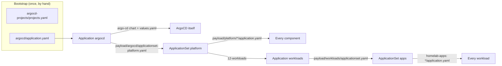

# GitOps Strategy

ArgoCD manages the cluster state declaratively: if it is not in Git, it is not
in the cluster, and if you put it there anyway the next reconcile puts it back —
with one qualification for the platform, [below](#what-the-staging-costs).

## Structure



`argocd` is the only Application not generated by the ApplicationSet and the
only one applied by hand. It syncs the chart that runs ArgoCD and, through a
second source, the `platform` ApplicationSet, so changes to the rollout arrive
through Git. It keeps `selfHeal`, which the generated Applications give up
under `RollingSync`. Its chart values are described in
[Platform &rarr; ArgoCD](../platform/argocd.md), along with the recovery
commands for the day ArgoCD syncs a broken ArgoCD config.

Everything else is a component directory with one `application.yaml`,
including ArgoCD's own supporting resources:

| Application | Stage | Holds |
| --- | --- | --- |
| `argocd-projects` | `00-projects` | the `apps`, `infra` and `system` AppProjects |
| `argocd-config` | `08-services` | ArgoCD's HTTPRoute, OIDC `ExternalSecret` and Grafana dashboard — after the Gateways and OpenBao exist |

The AppProjects cannot arrive through ArgoCD alone: an Application naming a
project that does not exist is rejected. `projects.yaml` is applied once at
bootstrap, ahead of the `argocd` Application that names `system`, and
`argocd-projects` adopts it on its first sync. A broken project definition is
fixed with `kubectl apply`, not a sync.

Each `application.yaml` is a complete Application, not a fragment: the
generator copies its labels, annotations, finalizers and `spec` unchanged, and
Renovate and the `Makefile` read it like any other manifest. A file without a
`homelab.wlkr.ch/stage` label fails the whole ApplicationSet rather than
quietly dropping out.

## Rollout order

The `platform` ApplicationSet uses a `RollingSync` strategy. Each Application
carries a `homelab.wlkr.ch/stage` label, the ApplicationSet has one step per
stage, and a step starts only once every Application in the step before it is
**Synced and Healthy**. The stages and what each waits for are in
[Platform &rarr; Rollout order](../platform/index.md#rollout-order).


Resource-level sync waves still order resources *inside* one Application: the
`certificates` Application applies its `ExternalSecret`, then the
ClusterIssuers, then the Certificates.

### Nothing may wait on a later stage

A step that needs Synced **and** Healthy turns every forward dependency into a
deadlock: a resource that cannot apply, or cannot go healthy, until a later
stage never finishes its step, so the later stage never starts. Three rules keep
the graph pointing one way:

- **A resource lives with what it needs, not with what it configures.** The
  `ClusterSecretStore` needs a running OpenBao, so it is in `openbao`, not
  `external-secrets`. cert-manager's issuers and certificates need the Route53
  credentials in OpenBao, so they are in `certificates`, not `cert-manager`.
- **CRDs come first.** A missing kind is a failed sync, and a failed sync is
  never Synced.
- **Routes do not gate.** An `HTTPRoute` stays Progressing until a Gateway
  accepts it, and the Gateways come late because they need certificates. The
  routes in `cilium`, `rook-ceph` and `openbao` carry
  `argocd.argoproj.io/ignore-healthcheck: "true"` so their Applications can be
  Healthy before `07-ingress`.

A new component goes in the earliest stage after everything it needs. If that
stage is later than something that needs it, the dependency is in the wrong
Application.

### Bootstrap pauses at OpenBao

`05-secrets` is where a fresh cluster stops on purpose. OpenBao's pods report
Ready while sealed, but the `ClusterSecretStore` beside it stays Degraded until
OpenBao is initialised, unsealed and has the Kubernetes auth role, so
`06-certificates` does not start until `make bao-init` and `make bao-unseal`.
`06-certificates` then waits for `make bao-secrets` to write the Route53
credentials. Nothing times out; the rollout resumes once the store validates.

### What the staging costs

Under `RollingSync` the ApplicationSet controller, not ArgoCD's automated sync,
syncs platform Applications. The `syncPolicy.automated` block is still read for
`prune` and `retry` still applies, but automated sync is switched off on every
generated Application and a sync is triggered only when its revision or spec
changes:

- **No self-heal.** A resource edited or deleted by hand stays that way until
  the next change to its Application. Any commit changes the revision of an
  Application with a Git source; one that only installs a chart — `alloy`,
  `external-secrets`, `kubelet-csr-approver`, `kured`, `loki`,
  `metrics-server`, `prometheus-operator-crds`, `rook-ceph-cluster`,
  `rook-ceph-operator`, `snapshot-controller`, `velero` — or pins a tag, like
  `gateway-api-crds`, changes only on a version bump.
- **A failed sync waits for a person.** Once `retry` is exhausted the
  Application and everything after it wait until its revision changes or it is
  synced by hand:

    ```bash
    argocd app sync <application>
    ```

- **Only changes are gated.** An Application that breaks later, with no new
  revision, holds nothing back; the next change that reaches it does.
- **Ceph warnings block.** ArgoCD maps `HEALTH_WARN` to Degraded, so while Ceph
  warns, no change reaches anything after `04-storage`.
- **Patching a generated Application's `spec` achieves nothing.** The next
  reconcile copies the file back over it.

Where a rollout is stuck, the ApplicationSet says which Application it is
waiting for:

```bash
kubectl -n argocd get applicationset platform \
  -o jsonpath='{range .status.applicationStatus[*]}{.step}{"\t"}{.status}{"\t"}{.application}{"\n"}{end}'
```

## Workloads live in a second repository

The applications the cluster exists to run are in
[`JanWelker/homelab-apps`](https://github.com/JanWelker/homelab-apps), one
directory per application; the `apps` ApplicationSet generates an Application
from each `*/application.yaml` there. The split keeps a platform change with a
cluster-wide blast radius apart from a workload change with a one-app one, and
keeps the reusable half of the cluster in a repository that could build
somebody else's.

The dependency runs one way: workloads reference the platform (the
`apps-gateway`, the `rook-ceph-block` StorageClass, the `openbao`
`ClusterSecretStore`, the CloudNativePG operator), and the platform references
the workloads repository exactly once — the `repoURL` in
`payload/workloads/applicationset.yaml`.

### What the split costs

- **Two repositories to clone**, and a change that spans both is two pull
  requests that cannot merge atomically; merge the platform half first.
- **The diff preview covers only this repository.** Both ApplicationSets carry
  `argocd-diff-preview/ignore` because the tool renders the repository it is
  given.
- **A workload can reference a platform resource that does not exist**, and
  nothing catches it until ArgoCD tries to sync.

### Ordering, and why workloads do not use RollingSync

The `apps` ApplicationSet has no `RollingSync`: workloads do not depend on each
other, and the platform they all depend on is guaranteed by *when the
ApplicationSet is created*. It ships inside the `workloads` Application at stage
`12-workloads`, so it does not exist until `11-policy` is Synced and Healthy.
That is why `payload/workloads/` is a sibling of `payload/platform/`, and why
the `platform` ApplicationSet names it as a second generator path rather than
a glob:

```yaml
        files:
          - path: payload/platform/*/application.yaml
          - path: payload/workloads/application.yaml
```

Because the workload Applications are not under a rolling strategy, **they keep
`selfHeal`**: a hand-edited workload Deployment is reverted within minutes.
Ordering *within* a workload uses resource-level sync waves — the CloudNativePG
`Cluster` is in an earlier wave, and ArgoCD's built-in health check for
`postgresql.cnpg.io/Cluster` waits for it before applying the application.

## Moving a resource to another Application

Moving a manifest between directories is not a move to ArgoCD: the old
Application sees a tracked resource vanish and, with `prune: true`, deletes
it; the new one recreates it, possibly seconds later. For a `ClusterSecretStore`
that is an outage of every secret; for a child `Application` with the resources
finalizer it deletes everything that Application deployed. A move takes two
merges:

1. Annotate the resource where it is, and let that sync:

    ```yaml
    annotations:
      argocd.argoproj.io/sync-options: Prune=false
      argocd.argoproj.io/compare-options: IgnoreExtraneous
    ```

    Both are read off the **live** object. `Prune=false` stops whichever
    Application prunes first; `IgnoreExtraneous` keeps the old Application
    Synced while it still sees the resource, without which it stays OutOfSync
    and blocks its stage.
2. Move the file, keeping the annotations. The new Application takes over the
   tracking annotation.

The annotations can go once the second change has synced everywhere.

## Version pins

Each version is pinned once, in the `application.yaml` that owns the
component, and never anywhere else. The `Makefile` reads `targetRevision` out
of those manifests for the bootstrap installs (`make install-cilium`,
`make install-argo`), so what bootstrap installs is what ArgoCD then
reconciles. Renovate updates the same line; its automerge policy is in
[Maintenance](../development/maintenance.md).
