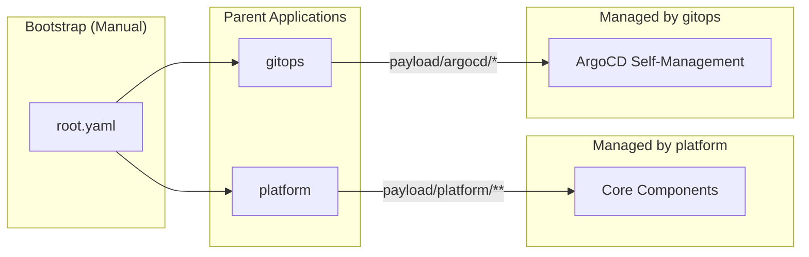
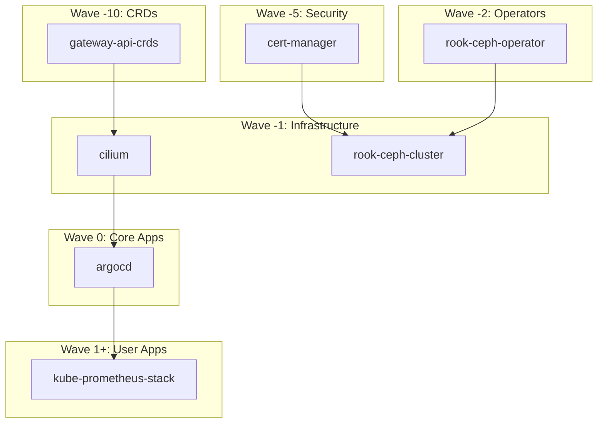

# GitOps Strategy

**ArgoCD** manages the cluster state declaratively. The rule is simple and
absolute: if it is not in Git, it is not in the cluster — and if you put it in
the cluster anyway, `selfHeal` will remove it while you are still admiring your
work.

This is not pedantry. It is the difference between a cluster you can rebuild
from a repository and a cluster held together by a series of `kubectl apply`
commands that exist only in one person's shell history.

## App-of-Apps Pattern

A hierarchical Application structure manages dependencies and logical grouping.
One `kubectl apply` of `payload/root.yaml` bootstraps everything else; from
there the repository discovers itself.

Yes, ArgoCD manages ArgoCD. It is exactly as recursive as it sounds, and it
works fine until the day you sync a broken ArgoCD config with ArgoCD. Keep
`make install-argo` in your back pocket for that day.

## Deployment Waves

ArgoCD uses **sync waves** to control deployment order. Lower waves sync first.
This ensures CRDs exist before Operators, and Storage exists before
Applications.

Sync waves are the answer to the question "why did my perfectly correct manifest
fail on a fresh cluster and work on an existing one?" On a running cluster
everything it depends on already exists. On a fresh one, ordering is the whole
game.

The full wave-by-wave listing is in [Platform &rarr; Usage](../platform/index.md#usage).
