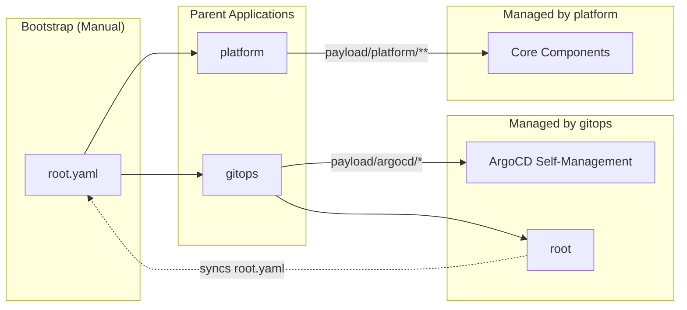
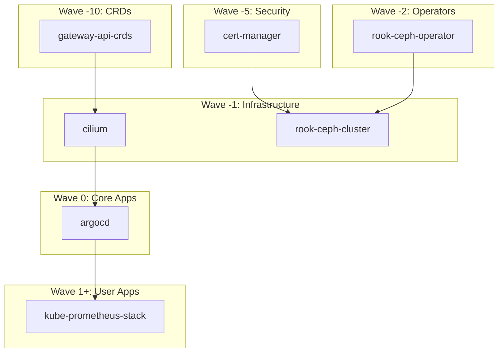

# GitOps Strategy

**ArgoCD** manages the cluster state declaratively. The rule is simple and
absolute: if it is not in Git, it is not in the cluster — and if you put it in
the cluster anyway, `selfHeal` will remove it while you are still admiring your
work.

This is not pedantry. It is the difference between a cluster you can rebuild
from a repository and a cluster held together by a series of `kubectl apply`
commands that exist only in one person's shell history.

## App-of-Apps Pattern

A hierarchical Application structure manages dependencies and logical grouping.
One `kubectl apply` of `payload/root.yaml` bootstraps everything else; from
there the repository discovers itself. That apply happens once: `gitops`
creates a `root` Application (`payload/argocd/root-application.yaml`) that syncs
`root.yaml`, so later edits to the parent Applications arrive through ArgoCD like
any other change.

`root` is defined in `payload/argocd/` rather than in `root.yaml` because the
already-running `gitops` Application can create it there; defining it inside
the file it syncs would need the same manual apply to exist at all. It omits
two things on purpose:

- **No prune.** Dropping a parent from `root.yaml` would delete that
  Application, and its resources finalizer would take every component beneath
  it along. Removing a parent stays a deliberate, manual step.
- **No resources finalizer.** Deleting `root` must not cascade into `platform`
  and `gitops`.



Yes, ArgoCD manages ArgoCD. It is exactly as recursive as it sounds, and it
works fine until the day you sync a broken ArgoCD config with ArgoCD. Keep
`make install-argo` in your back pocket for that day.

## Deployment Waves

ArgoCD uses **sync waves** to control deployment order. Lower waves sync first.
This ensures CRDs exist before Operators, and Storage exists before
Applications.

Sync waves are the answer to the question "why did my perfectly correct manifest
fail on a fresh cluster and work on an existing one?" On a running cluster
everything it depends on already exists. On a fresh one, ordering is the whole
game.



The full wave-by-wave listing is in [Platform &rarr; Usage](../platform/index.md#usage).

### A missing CRD is a deadlock, not a delay

A custom resource whose CRD does not exist yet does not merely fail and retry.
ArgoCD marks the task `SyncFailed`, leaves the operation `Running` while it
waits on the rest of the wave to become healthy, and starts no new sync until
that one finishes. When the resource it could not apply is the credential the
wave is waiting for, nothing ever moves again.

That is why `external-secrets` sits at wave `-6`: ahead of every Application
that ships an `ExternalSecret`, the earliest of which is cert-manager at `-5`.
`SkipDryRunOnMissingResource=true` on each `ExternalSecret` covers the first
sync of a fresh cluster, where the CRDs have not landed yet.

## Moving a resource to another Application

Moving a manifest from one Application's directory to another's is not a move
to ArgoCD. The old Application sees a resource it tracks vanish from Git and,
with `prune: true`, deletes it; the new one creates it again, possibly first,
possibly seconds later. For a `ClusterSecretStore` that is an outage of every
secret. For a child `Application` with the resources finalizer it is the
deletion of everything that Application deployed.

So a move takes two changes:

1. Annotate the resource where it is, and let that sync:

    ```yaml
    annotations:
      argocd.argoproj.io/sync-options: Prune=false
      argocd.argoproj.io/compare-options: IgnoreExtraneous
    ```

    Pruning skips a resource whose **live** object carries `Prune=false`,
    whichever Application gets there first. `IgnoreExtraneous` keeps the old
    Application Synced while it still sees the resource it may no longer prune;
    without it the old Application stays OutOfSync until the new one has
    applied the resource, which is a deadlock when a sync gate waits on the old
    one first.
2. Move the file, keeping the annotations. The new Application applies it and
   takes over the tracking annotation; the old one no longer considers the
   resource its own.

The annotations can go once the second change has synced everywhere.

## ArgoCD's own configuration

`payload/argocd/values.yaml` holds the chart values. The parts that are not
self-explanatory:

| Setting | Why |
| --- | --- |
| `redis-ha.haproxy` `maxSurge: 0` | Three replicas with hard per-host anti-affinity and only three schedulable nodes. The default strategy surges a fourth pod with nowhere to land, wedging every rollout until the progress deadline gives up. Retiring first frees the node |
| Memory limits, no CPU limits | Limits are about 2.5x the measured peak working set; requests are about steady state. A CPU limit throttles even on an idle node, while memory is not compressible, so only memory is capped |
| `controller` has no resources | The application-controller peaked at 1639Mi and grows with the number of managed resources; a day of steady state is not enough to size it |
| `metrics.enabled` on four components | Creates the `<component>-metrics` Services whose names are the `job` label the vendored dashboard filters on. The ServiceMonitors render only once the Prometheus operator CRDs exist, so `make install-argo` still works first |
| `admin.enabled: "false"` | With SSO in front, a shared admin password would bypass it with no audit trail. Re-enabling it is the [break-glass path](../platform/authentik.md#when-authentik-is-down) |
| `applicationsetcontroller.enable.progressive.syncs` | Lets an ApplicationSet with a `RollingSync` strategy order the Applications it generates. Without the flag the strategy is ignored and every Application syncs at once |
| `policy.default: ""` | An authenticated user with no matching Authentik group gets no access, not read-only-everything |

The OIDC client ID and secret come from `kv/authentik/config`, the same OpenBao
path Authentik's blueprint reads, so neither side is copied out of a UI after a
rebuild. `argocd-cm` refers to them as `$argocd-oidc:client-id`; ArgoCD resolves
a `$name:key` reference only against a Secret labelled
`app.kubernetes.io/part-of: argocd`, which the `ExternalSecret` template sets.

The Grafana dashboard in `argocd-dashboard.yaml` is upstream's
`examples/dashboard.json`, unmodified, at the Argo CD version the chart deploys.
The chart renders none, so it is vendored — and Renovate does not see it: re-copy
it when Argo CD moves a minor version.
