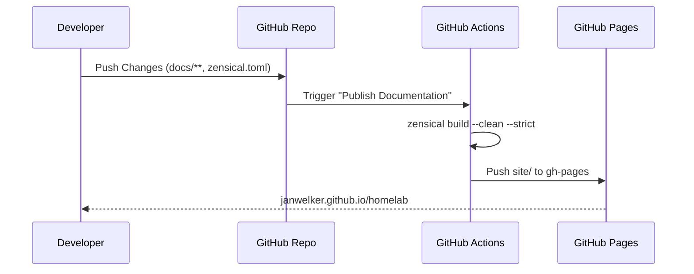

# Documentation System

The project documentation (this site) is built with
[Zensical](https://zensical.org/) and published to GitHub Pages by a GitHub
Actions workflow.

Deliberately not hosted on the cluster. Documentation that goes down with the
thing it documents is documentation you cannot read at the exact moment you need
it, which is a mistake people make once.

## Workflow

1. **Authoring**: Documentation is written in Markdown within `docs/`. The site
    is configured in `zensical.toml` at the repository root, and `overrides/`
    holds the handful of theme templates this project replaces.
2. **Build**: On push to `main`, the `docs.yaml` workflow runs
    `zensical build --clean --strict`, producing a static site in `site/`.
3. **Deploy**: The workflow drops a `.nojekyll` marker into `site/` and pushes
    it to the `gh-pages` branch, which GitHub Pages serves at
    <https://janwelker.github.io/homelab/>. Without the marker Pages runs the
    branch through Jekyll, which silently drops any path Jekyll considers
    private. The deploy cleans the branch but excludes `pr-preview/`, so it
    leaves the open pull-request previews in place.

No container image, registry, or cluster is involved — the docs stay available
independently of the homelab. Someone else's uptime problem, for once.



## Pull request previews

`preview.yaml` builds every pull request that touches `docs/`, `overrides/` or
`zensical.toml` and publishes it under `pr-preview/` on the same `gh-pages`
branch; closing the PR removes it. Its path filter has to match `docs.yaml`,
because this is the only `--strict` build a pull request gets: a nav or theme
change in `zensical.toml` breaks the build as readily as a broken link, and
without that path it would reach `main` unbuilt. The same build works from the
preview subdirectory because the theme resolves its links relative to the page.

PRs from forks are skipped. They run without write access, so the deploy would
only fail.

## Working locally

Zensical is declared in the `dev` dependency group of `pyproject.toml`:

```bash
uv sync --dev
uv run zensical serve   # http://localhost:8000, rebuilds on save
uv run zensical build   # one-off build into site/
```

`site/` is gitignored.

## Conventions

- Every page must be reachable from the `nav` in `zensical.toml`; the build runs
    with `--strict`, so broken links and orphaned pages fail CI. Strict mode is
    unforgiving and that is the point — rotten cross-references are how a docs
    site stops being trusted.
- Cross-references use relative Markdown paths (for example
    `platform/openbao.md`, `../quickstart.md`) so they resolve both on the site
    and when browsing the repository on GitHub.
- Diagrams use Mermaid fences; Zensical initialises the runtime automatically on
    pages that contain one.
- Markdown is linted by `lint-markdown.yaml` and the `markdownlint-cli2`
    pre-commit hook. Note that `markdownlint` reads a blank line followed by an
    indented one as a code block, so a multi-paragraph `!!!` admonition trips
    `MD046`. Keep admonition bodies to a single paragraph. This one will catch
    you, probably today.
- Inline HTML is limited to `<div>` (`MD033` in `.markdownlint-cli2.yaml`):
    the card grids on the hub pages need a wrapping `<div class="grid cards">`,
    and the theme has no Markdown syntax for them.
- Theme templates are overridden by dropping a same-named file under
    `overrides/` (wired up via `theme.custom_dir`). Currently only
    `partials/source.html`, which drops the repository-facts API call that 404s
    because this repository publishes no releases.
- Fonts are self-hosted, so the published site makes no third-party requests.
    `theme.font = false` in `zensical.toml` suppresses the theme's Google Fonts
    `<link>`, and `docs/stylesheets/fonts.css` declares Inter and JetBrains Mono
    from the `woff2` files in `docs/assets/fonts/`. Those come from the upstream
    releases ([Inter](https://github.com/rsms/inter/releases) and
    [JetBrains Mono](https://github.com/JetBrains/JetBrainsMono/releases)); the
    SIL OFL licence of each sits next to them. `scripts/update-fonts.sh` pins
    both versions and downloads them (`make fonts`), and Renovate opens a PR on
    the pins — see [Maintenance](maintenance.md#vendored-binaries-need-a-follow-up-commit)
    for why that PR needs a second commit.
