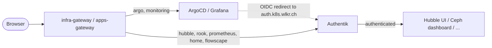

# Authentik

[Authentik](https://goauthentik.io/) is the cluster's identity provider. Every
platform UI sits behind one login instead of a chart-default password each —
and Hubble UI, which ships no authentication at all, would otherwise publish
every network flow in the cluster to anyone who could reach the hostname.

| Service | Authentication |
| --- | --- |
| ArgoCD | OIDC, local admin **disabled** |
| Grafana | OIDC, login form disabled |
| Nextcloud | OIDC, login form hidden, local admin break-glass |
| Home Assistant | Proxy outpost **in front of** its own login — see [Pitfalls](#pitfalls) |
| Rook dashboard, Hubble UI, Prometheus, Alertmanager | Proxy outpost |

## At a glance

| | |
| --- | --- |
| Namespace | `authentik` |
| Depends on | [OpenBao](openbao.md) for its OIDC client secrets, [CloudNativePG](cloudnative-pg.md) for the database, [Rook-Ceph](rook-ceph.md) under it |
| If it is down | Every platform UI loses its only login — see [When Authentik is down](#when-authentik-is-down) |
| Health check | `kubectl -n authentik get pods,clusters` &rarr; server and worker Ready, `authentik-db` healthy |
| UI | `auth.k8s.wlkr.ch` |
| Files | `payload/platform/authentik/` |

## Configuration

### Two integration styles

**OIDC**, for applications that can do it themselves: ArgoCD and Grafana map
group membership to a role. **Proxy**, for the rest: the hostname resolves to
Authentik's embedded outpost, a reverse proxy that authenticates the request
and only then forwards it to the backend. It needs nothing from the
application and protects exactly as far as nothing else can reach the backend.



### One hostname

Authentik answers on `auth.k8s.wlkr.ch` only, on `apps-gateway`, which the
LAN reaches through the router's local record and the outside through
Route53. Every OIDC client and the embedded outpost use that one name.

The outpost is why there is only one. A proxied application's route points
at `authentik-server`, but the login itself is an OAuth dance: the outpost
sends the browser to the outpost's `authentik_host` to authenticate and gets
it back on the application's own hostname. With Authentik on two names and
`authentik_host` on the LAN-only one, an application on `apps-gateway`
worked at home and redirected outside users to a name that does not
resolve. `blueprints.yaml` pins `authentik_host` because the embedded
outpost otherwise fills it from `web.base_url` on first start and never
updates it.

!!! warning "A client must never mix names"
    The `iss` claim is the hostname the token was issued through. A discovery URI on one name and a redirect on another fails every login with an error that blames the token. Should a second hostname ever come back, pin each client to exactly one.

### Where the proxied routes point

A proxied application's route lives with the application: Hubble's in
`payload/platform/cilium/`, Rook's in `payload/platform/rook-ceph/`,
Prometheus's and Alertmanager's in `payload/platform/monitoring/`, and Home
Assistant's and Flowscape's in the
[workloads repository](../development/add-workload.md),
each with `authentik-server` as `backendRef`. Gateway API forbids a
cross-namespace `backendRef` unless the target namespace grants it, so
`referencegrant.yaml` here allows `HTTPRoute` objects from exactly those
namespaces to that Service only. A proxied workload is therefore two pull
requests, by design: a workload cannot take itself out from behind the
authentication layer on its own.

### Database

`database.yaml` is a CloudNativePG `Cluster` with three instances, the only
one on the cluster with more than one. Every login on every platform UI
goes through Authentik, so its database must survive a node drain: with one
instance the operator's PodDisruptionBudget blocks the drain and a reboot
kills the database; with three, the primary switches over and the drain
proceeds. The chart's own Postgres subchart is off — see
[the contract](cloudnative-pg.md#the-contract).

### Chart values

| Setting | Why |
| --- | --- |
| `authentik.disable_update_check` and `authentik.avatars` | Telemetry and Gravatar lookups are switched off in config, not permitted by network policy — the same rule as Grafana, Loki and Alloy |
| `authentik.web.base_url` | Authentik builds e-mail links and outpost redirects from it and cannot infer it; unset, every admin page shows "The base URL has not been configured". The chart value backfills the tenant, so a rebuilt cluster needs no click |
| `metrics.enabled` and `metrics.serviceMonitor.enabled` | The ServiceMonitor renders only when both are set; the switch alone produces nothing, silently. The worker is scraped too: tasks, outpost state and blueprint runs are measured there |
| `postgresql.enabled: false`, `authentik.postgresql.host: authentik-db-rw` and the `global.env` entry | The database is the `Cluster` above. The password is the one CloudNativePG generated into `authentik-db-app`, read as `AUTHENTIK_POSTGRESQL__PASSWORD` from that Secret; it is never copied into OpenBao or Git |
| `worker.podAnnotations` `homelab.wlkr.ch/secret-generation` | Bumped whenever `authentik-secrets` or `authentik-secrets-nextcloud` gains a key, so ArgoCD restarts the worker in the same sync — see [Pitfalls](#pitfalls) |
| Workload blueprints as a `projected` volume, `optional: true` | `blueprints.configMaps` renders a plain `configMap` volume, and the kubelet refuses a pod whose ConfigMap is missing. Workload blueprints arrive with the [workloads](../architecture/gitops.md#workloads-live-in-a-second-repository), which a fresh cluster may not have yet, so a required mount would keep the worker from starting |

### Where a blueprint lives

Providers and applications are blueprints, so a rebuild reproduces them.
`!Find` resolves objects Authentik ships, `!KeyOf` references another entry in
the same blueprint, and `!Env` reads an environment variable, which keeps
client secrets out of Git. `blueprints_discovery` runs on worker startup,
hourly and on a file watcher, asynchronously, so anything configuring itself
against a provider must tolerate it not existing yet.

| What | Lives in | Why there |
| --- | --- | --- |
| Platform providers, applications, the outpost | `blueprints.yaml` | Mounted into the worker as a ConfigMap |
| A workload's provider and application | The workload's directory in the workloads repository, as a ConfigMap targeted at `authentik` | The provider and the application it authenticates change in one commit |
| Client credentials | `bao-secrets.sh`, read by `secrets.yaml` | A workload cannot mint its own; SSO onboarding stays a deliberate two-repository act |
| The mount entry and `secret-generation` | `application.yaml` | One projected-volume source per workload; a new credential needs the worker restarted |
| The outpost's `providers:` list | `blueprints.yaml` | It replaces one global object; two repositories writing it would overwrite each other |
| `referencegrant.yaml` | Here | A proxied workload's route needs granting from this side |

### Groups and roles

Authorisation is group membership. Create these in Authentik and add users:

| Group | Grants |
| --- | --- |
| `argocd-admins` | ArgoCD `role:admin` |
| `argocd-viewers` | ArgoCD `role:readonly` |
| `grafana-admins` | Grafana `Admin` |
| `grafana-editors` | Grafana `Editor` |

ArgoCD's `policy.default` is empty, so a user in neither ArgoCD group gets
**no** access; Grafana falls back to `Viewer`. Access to a proxied application
is bound to the application in Authentik itself.

## Usage

### Client secrets

The OIDC client IDs and secrets are generated once into OpenBao and read by
both sides — Authentik through `!Env`, ArgoCD and Grafana through their own
`ExternalSecret` — so a rebuilt Authentik gets the same credentials and
nothing is copied out of a UI. `make bao-secrets` writes `kv/authentik/config`
with the secret key, the bootstrap password and token and the ArgoCD and
Grafana client pairs; `scripts/bao-secrets.sh` is the list of keys. A
workload's client credentials go in the workload's own path (Nextcloud's in
`kv/nextcloud/config`, read by `secrets-nextcloud.yaml`, mounted
`optional`): rewriting `kv/authentik/config` would rotate the secret key
that signs every session and token, and External Secrets fails an
`ExternalSecret` whole when one key is missing, so a shared one would leave
a cluster without the workload with no `AUTHENTIK_SECRET_KEY` either.

Then log in at [auth.k8s.wlkr.ch](https://auth.k8s.wlkr.ch) as
`akadmin` with `bootstrap-password` and create the groups above.

### Adding an application

1. Generate its client credentials into OpenBao and add them to
   `bao-secrets.sh` and an `ExternalSecret` (a workload's own, mounted
   `optional`, like `secrets-nextcloud.yaml`).
2. Bump `homelab.wlkr.ch/secret-generation` in `application.yaml`.
3. Add the provider and application blueprint: an OAuth2 provider with
   `grant_types`, or a proxy provider added to the outpost's `providers:` list.
4. For a proxied application, point its `HTTPRoute` at `authentik-server` and
   add its namespace to `referencegrant.yaml`.
5. Bind the groups or policies that may reach it, in Authentik.

## Health check

When every login fails, in this order:

1. Server and worker are Ready and the database is healthy:

    ```bash
    kubectl -n authentik get pods,clusters
    ```

2. The discovery document names the one hostname as `issuer`:

    ```bash
    curl -s https://auth.k8s.wlkr.ch/application/o/argocd/.well-known/openid-configuration | jq .issuer
    ```

3. The embedded outpost is healthy (`Outposts` in the admin UI, or):

    ```bash
    kubectl -n authentik logs deploy/authentik-server | grep -i outpost | tail
    ```

4. The worker applied the blueprints — a failed one names its file:

    ```bash
    kubectl -n authentik logs deploy/authentik-worker | grep -i blueprint | tail
    ```

## Pitfalls

!!! danger "A new client credential needs the worker restarted"
    `envFrom` injects `authentik-secrets` **once, when the pod starts**. A blueprint reading a newly added credential through `!Env` on a running worker gets an empty string and creates a provider that answers 404 on its discovery endpoint. Bumping `secret-generation` restarts the worker in the sync that adds the credential; `kubectl rollout restart` fixes a running cluster but leaves nothing for the next one.

!!! warning "OAuth2 providers must name their grant types"
    `grant_types` defaults to an empty list. A provider that omits it serves no grants, and every login fails with `invalid_request: The request is otherwise malformed`.

!!! warning "The outpost entry replaces its provider list"
    `authentik_outposts.outpost` sets `providers` wholesale. Every proxied application must be listed there; adding one and forgetting the list silently unassigns the others, which fail open.

!!! note "Home Assistant is the exception"
    It has a login of its own and upstream ships no OIDC provider to replace it, so the outpost sits *in front of* it: browser users authenticate twice, which is defence in depth rather than single sign-on. The companion apps and webhooks hold a long-lived token and cannot complete an interactive login, so `skip_path_regex` lets `/api/`, `/auth/token` and the external-auth callback through. Home Assistant's own accounts are the only thing guarding those paths; revoking an Authentik account does not revoke a Home Assistant token.

## Recovery

### When Authentik is down

Single sign-on is a single point of failure for logging in at all. The ArgoCD
path needs a working `kubectl`, so keep a kubeconfig off-cluster.

**ArgoCD** — re-enable the local admin account:

```bash
kubectl -n argocd patch cm argocd-cm --type merge \
  -p '{"data":{"admin.enabled":"true"}}'
kubectl -n argocd rollout restart deploy/argocd-server
```

**Grafana** — the login form is hidden, not removed: the admin account works
through the API, and `GF_AUTH_DISABLE_LOGIN_FORM=false` brings the form back.

**Proxied dashboards** have no bypass; port-forward instead:

```bash
kubectl -n kube-system port-forward svc/hubble-ui 8080:80
kubectl -n monitoring port-forward svc/kube-prometheus-stack-prometheus 9090:9090
```

### ArgoCD's API key account

Disabling the local admin also removes its `apiKey` capability. If a token is
needed, add an account scoped to what the token is for rather than
re-enabling admin:

```yaml
configs:
  cm:
    accounts.mcp: apiKey
  rbac:
    policy.csv: |
      p, role:mcp, applications, get, */*, allow
      g, mcp, role:mcp
```
