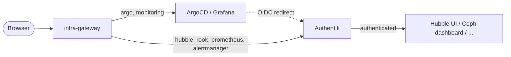

# Authentik

[Authentik](https://goauthentik.io/) is the cluster's identity provider. Every
platform UI sits behind one login.

The alternative — the state most homelabs live in — is six dashboards with six
different credentials, three of which are the chart default, one of which is
written on a sticky note, and one of which has no authentication at all because
the project never shipped any.

| Service | Authentication |
| --- | --- |
| ArgoCD | OIDC, local admin **disabled** |
| Grafana | OIDC, login form disabled |
| Rook dashboard | Proxy outpost |
| Hubble UI | Proxy outpost |
| Prometheus | Proxy outpost |
| Alertmanager | Proxy outpost |

Left to themselves these each carry a different answer — a local `admin` account
with an API key, a chart-generated password, separate Ceph credentials — and
Hubble UI carries none at all, which would publish cluster-wide network flow
data to anyone who could reach the hostname. Hubble is the one that should make
you sit up: it is a live map of every connection in the cluster, served without
so much as a password prompt.

## Two integration styles

**OIDC**, for applications that can do it themselves. ArgoCD and Grafana each
talk to Authentik directly and map group membership to a role.

**Proxy**, for the four that cannot. Authentik's embedded outpost is a reverse
proxy: the hostname resolves to the outpost, the outpost authenticates the
request, and only then forwards it to the real backend. No support is needed
from the application, which is the only option for something like Hubble. It is
the classic auth-in-front-of-a-dumb-backend pattern, and it works precisely as
well as your certainty that nothing else can reach the backend directly.



### Where the proxied routes point

The `HTTPRoute` for `hubble.infra.k8s.wlkr.ch` stays in `payload/platform/cilium/`
next to the thing it exposes, but its `backendRef` is `authentik-server` in the
`authentik` namespace. Gateway API forbids a cross-namespace `backendRef` unless
the target namespace grants it, so `referencegrant.yaml` allows exactly that:
`HTTPRoute` objects, from `kube-system` and `rook-ceph` only, to the
`authentik-server` Service only.

Prometheus and Alertmanager have no route of their own to reuse, so theirs live
in the `authentik` directory. **Neither has authentication of its own** —
publishing them at all is only defensible because the outpost authenticates in
front of them.

## Configuration as code

Providers and applications are declared in blueprints
(`blueprints.yaml`), mounted into the worker as a ConfigMap. Clicking them
together in the UI would mean losing them on the next rebuild — and identity
configuration is exactly the sort of thing you set up once, forget entirely, and
then cannot reconstruct under pressure two years later.

Three tags do the work:

- `!Find` resolves objects Authentik ships by default, such as the default
  authorization flow.
- `!KeyOf` references another entry in the same blueprint by its `id`.
- `!Env` reads an environment variable, which is how client secrets get in
  without being written to Git.

!!! warning "The outpost entry replaces its provider list"
    The `authentik_outposts.outpost` entry sets `providers` wholesale rather than appending. Every proxied application must be listed there — adding a fifth and forgetting this line silently unassigns the other four, which means four dashboards quietly stop being protected rather than loudly breaking. Failing open is the worst failure mode a security control can have.

## Client secrets are generated up front

The OIDC client ID and secret are shared values: Authentik needs them, and so do
ArgoCD and Grafana. Rather than letting Authentik mint a secret that then exists
only in its database, both are generated once into OpenBao and read from there
by both sides — Authentik through `!Env`, the clients through their own
`ExternalSecret`.

That is what makes the whole thing reproducible: a rebuilt Authentik gets the
same client credentials, and nothing has to be copied out of a UI. Anything that
exists only inside a running system's database is not configuration, it is a
hostage situation.

```bash
bao kv put kv/authentik/config \
  secret-key="$(openssl rand -base64 60 | tr -d '\n')" \
  postgres-password="$(openssl rand -base64 32 | tr -d '\n')" \
  bootstrap-password="$(openssl rand -base64 24 | tr -d '\n')" \
  bootstrap-token="$(openssl rand -hex 32)" \
  argocd-client-id="$(openssl rand -hex 16)" \
  argocd-client-secret="$(openssl rand -base64 48 | tr -d '\n')" \
  grafana-client-id="$(openssl rand -hex 16)" \
  grafana-client-secret="$(openssl rand -base64 48 | tr -d '\n')"
```

Then log in at [auth.infra.k8s.wlkr.ch](https://auth.infra.k8s.wlkr.ch) as
`akadmin` with `bootstrap-password`, and create the groups below.

## Groups and roles

Authorisation is group membership. Create these in Authentik and add users:

| Group | Grants |
| --- | --- |
| `argocd-admins` | ArgoCD `role:admin` |
| `argocd-viewers` | ArgoCD `role:readonly` |
| `grafana-admins` | Grafana `Admin` |
| `grafana-editors` | Grafana `Editor` |

ArgoCD's `policy.default` is empty, so an authenticated user in neither ArgoCD
group gets **no** access rather than read-only-everything. That default is worth
copying elsewhere: "authenticated" and "authorised" are different questions, and
plenty of systems answer the second one with a shrug. Grafana falls back to
`Viewer`.

Access to a proxied application is controlled in Authentik itself, by binding
policies or groups to the application.

## When Authentik is down

Authentik becoming a dependency of every UI is the cost of this, and it is a real
one: single sign-on is also a single point of failure for logging in at all.
Read this section *before* you need it, because the ArgoCD escape hatch below
requires a working `kubectl`, and you will be reaching for it on the day nothing
else works. Both OIDC integrations keep a break-glass path:

**ArgoCD** — re-enable the local admin account:

```bash
kubectl -n argocd patch cm argocd-cm --type merge \
  -p '{"data":{"admin.enabled":"true"}}'
kubectl -n argocd rollout restart deploy/argocd-server
```

**Grafana** — the login form is hidden, not removed. The admin account still
works through the API, and setting `GF_AUTH_DISABLE_LOGIN_FORM=false` brings the
form back.

The four proxied dashboards have no bypass: with the outpost down, the hostname
does not answer, full stop. Reach them by port-forward instead — which is a
reminder that `kubectl port-forward` is the universal break-glass tool and the
reason keeping a working kubeconfig off-cluster matters:

```bash
kubectl -n kube-system port-forward svc/hubble-ui 8080:80
kubectl -n monitoring port-forward svc/kube-prometheus-stack-prometheus 9090:9090
```

### ArgoCD's API key account

Disabling the local admin also removes the `accounts.admin: apiKey` capability
that was configured for MCP integration. If a token is still needed, add a
dedicated account rather than re-enabling admin — an account scoped to what the
token is for is easier to reason about and to revoke:

```yaml
configs:
  cm:
    accounts.mcp: apiKey
  rbac:
    policy.csv: |
      p, role:mcp, applications, get, */*, allow
      g, mcp, role:mcp
```

## Directory Structure

```text
authentik/
├── application.yaml       # ArgoCD Application (Helm: goauthentik/authentik)
├── secrets.yaml           # ExternalSecret: secret key, DB and OIDC clients
├── blueprints.yaml        # ConfigMap: providers, applications, outpost
├── httproute.yaml         # auth / prometheus / alertmanager hostnames
└── referencegrant.yaml    # Lets the hubble and rook routes reach the outpost
```
