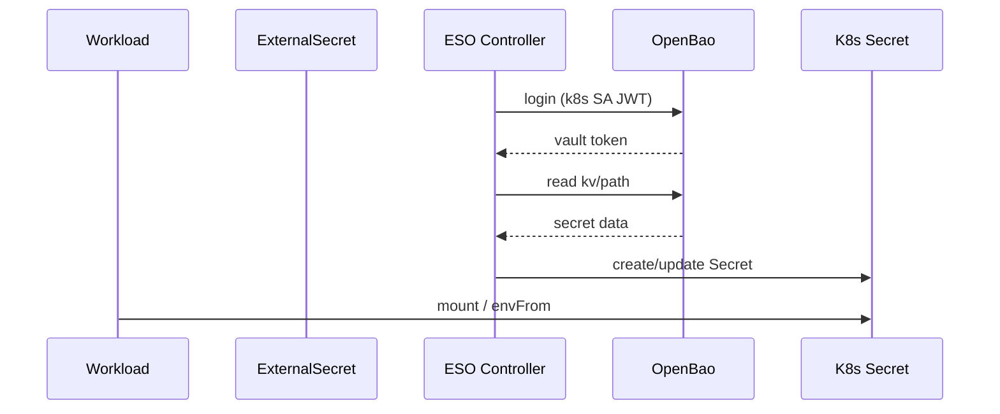

# External Secrets Operator

[External Secrets Operator (ESO)](https://external-secrets.io/) bridges
[OpenBao](openbao.md) to native Kubernetes `Secret` objects. Workloads consume
secrets the standard way — `envFrom`, `volumeMounts`, `imagePullSecrets` —
with no sidecar, no init container and no code that knows what a Vault token
is.

## At a glance

| | |
| --- | --- |
| Namespace | `external-secrets` |
| Stage | `03-controllers`; the `ClusterSecretStore` is in `openbao`, at `05-secrets` — see [why](index.md#rollout-order) |
| Depends on | [OpenBao](openbao.md) at runtime, though not to be installed |
| If it is down | Secrets already materialised keep working. Nothing rotates, and nothing new resolves |
| Health check | `kubectl get clustersecretstore openbao` &rarr; `Valid` |
| Files | `payload/platform/external-secrets/`; the store in `payload/platform/openbao/cluster-secret-store.yaml` |

## Configuration



ESO mints a short-lived token for its `external-secrets-vault` ServiceAccount
through the TokenRequest API (the `external-secrets-vault-token-creator`
ClusterRole); OpenBao validates it against the TokenReview API and issues a
token bound to the `external-secrets` policy. No long-lived credential exists
anywhere, and when it breaks it breaks in the `ClusterSecretStore` status. The
store uses ESO's `vault` provider unchanged against the in-cluster Service.

| Setting | Why |
| --- | --- |
| Stage `03-controllers` | Ahead of every Application that ships an `ExternalSecret`; a missing kind fails the sync that [gates the stage](../architecture/gitops.md) |
| No `ClusterSecretStore` here | It only validates against a running, unsealed OpenBao, so it ships with `openbao`; here it would hold `03-controllers` for two stages |
| Webhook ServiceAccount token stays mounted | The webhook has no RoleBinding but builds an in-cluster client at startup and exits without the token (`unable to load in-cluster config`), which only shows when the pod is recreated |

## Usage

### Adding a secret

1. Store the value in OpenBao, following the [KV layout](openbao.md#kv-layout):

    ```bash
    bao kv put kv/<workload>/<purpose> key1="value1" key2="value2"
    ```

2. Declare an `ExternalSecret` alongside the workload's other manifests; the
   parent Application picks it up:

    ```yaml
    ---
    apiVersion: external-secrets.io/v1
    kind: ExternalSecret
    metadata:
      name: my-app-credentials
      namespace: my-app
      annotations:
        # ESO and its CRDs install in 03-controllers; this covers a sync
        # before they have landed.
        argocd.argoproj.io/sync-options: SkipDryRunOnMissingResource=true
    spec:
      refreshInterval: 1h
      secretStoreRef:
        name: openbao
        kind: ClusterSecretStore
      target:
        name: my-app-credentials   # name of the resulting K8s Secret
        creationPolicy: Owner
      data:
        - secretKey: key1           # key in the K8s Secret
          remoteRef:
            key: <workload>/<purpose>
            property: key1          # key inside the KV entry
    ```

    To pull every key without listing them, use `dataFrom` instead of `data`:

    ```yaml
    spec:
      dataFrom:
        - extract:
            key: <workload>/<purpose>
    ```

3. Consume the Secret:

    ```yaml
    spec:
      containers:
        - name: my-app
          envFrom:
            - secretRef:
                name: my-app-credentials
    ```

`refreshInterval` polls OpenBao; `0` disables polling and re-syncs only on
resource changes. To sync now rather than wait:

```bash
kubectl annotate externalsecret -n <namespace> <name> \
  force-sync=$(date +%s) --overwrite
```

## Health check

Start with the store; if it is not Ready, nothing downstream is either:

```bash
kubectl get clustersecretstore openbao -o jsonpath='{.status}' | jq
```

| Cause | Fix |
| --- | --- |
| OpenBao is sealed | [Unseal it](openbao.md#unsealing-after-a-restart) |
| Kubernetes auth role missing | Re-run `make bao-init`, which writes `auth/kubernetes/role/external-secrets` |
| Wrong `serviceAccountRef` | Must be `external-secrets-vault` in `external-secrets` |

Then the individual object:

```bash
kubectl describe externalsecret -n <namespace> <name>
```

| Cause | Fix |
| --- | --- |
| The KV path does not exist (`bao kv get kv/<path>` returns 404) | Store the secret first |
| `property:` matches no key in the KV entry | `bao kv get kv/<path>` lists them |
| The policy does not grant `read` on the path | Edit the `external-secrets` policy |

## Pitfalls

!!! warning "Rotation does not restart anything"
    A rotated value reaches the `Secret` within `refreshInterval`, but a pod that read it into an environment variable keeps the old one until something restarts it. A rollout, or Reloader-style tooling, is the other half of rotation.
