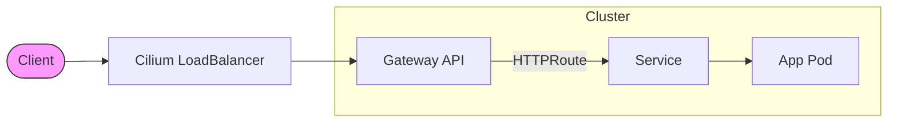

# Platform

The core infrastructure components that run the cluster, all managed by
ArgoCD. Every one of them exists because bare metal does not come with the
thing a cloud provider would have handed you: no load balancer, no managed
certificates, no block storage API, no identity provider, no backup service.

## Components

One row per directory under `payload/platform/`, with the Application name
where it differs from the directory — that is the name `kubectl -n argocd get
applications` shows — and the namespace it lands in.

| Component | Namespace | What it does |
| --- | --- | --- |
| alloy | `logging` | Grafana Alloy, the log shipper — see [Logging](logging.md) |
| [argocd](argocd.md) | `argocd` | ArgoCD itself and the `platform` ApplicationSet |
| argocd-config | `argocd` | ArgoCD's own HTTPRoute, OIDC credentials and Grafana dashboard — see [ArgoCD](argocd.md) |
| argocd-projects | `argocd` | The `apps`, `infra` and `system` AppProjects |
| [authentik](authentik.md) | `authentik` | Single sign-on for every platform UI |
| backup | `backup` | Velero's buckets, the `VolumeSnapshotClass` and an etcd snapshot CronJob — see [Backups & Recovery](../operations/backups.md) |
| [cert-manager](cert-manager.md) | `cert-manager` | The cert-manager chart |
| certificates | `cert-manager` | The Let's Encrypt issuers and the two Gateway wildcards — see [cert-manager](cert-manager.md) |
| [cilium](cilium.md) | `kube-system` | CNI, `kube-proxy` replacement, Gateway API, LoadBalancer addresses, WireGuard, Hubble |
| [cloudnative-pg](cloudnative-pg.md) | `cnpg-system` | The PostgreSQL operator every workload database runs on |
| [external-dns](external-dns.md) | `external-dns` | Publishes Route53 records from HTTPRoutes |
| [external-secrets](external-secrets.md) | `external-secrets` | Bridges OpenBao to native Kubernetes Secrets |
| [gateway-api](gateway-api.md) | `kube-system` | The two Gateways and the HTTP-to-HTTPS redirect |
| gateway-api-crds | `kube-system` | The Gateway API CRDs — see [Gateway API](gateway-api.md) |
| kube-vip | `kube-system` | Holds the control-plane VIP; adopts the static pod Ignition bootstraps — see [Control Plane VIP](../operations/control-plane-vip.md) |
| kubelet-csr-approver | `kubelet-csr-approver` | Approves `kubelet-serving` CSRs against the inventory — see [Metrics Server](metrics-server.md#verifying-the-kubelet-instead-of-trusting-it) |
| [kured](kured.md) | `kured` | Drains and reboots nodes to apply staged OS, Kubernetes and containerd updates |
| [logging](logging.md) | `logging` | Loki's bucket, rules, dashboards and Grafana datasource |
| loki | `logging` | The Loki chart — see [Logging](logging.md) |
| [metrics-server](metrics-server.md) | `kube-system` | The `metrics.k8s.io` API behind `kubectl top` and every HPA |
| monitoring, Application `kube-prometheus-stack` | `monitoring` | Prometheus, Grafana, Alertmanager, node-exporter, kube-state-metrics — see [Monitoring](monitoring.md) |
| [openbao](openbao.md) | `openbao` | Cluster-wide secret store |
| prometheus-operator-crds | `monitoring` | The Prometheus operator CRDs, separate so every chart that ships a `ServiceMonitor` can sync — see [Monitoring](monitoring.md#crds) |
| [rook-ceph](rook-ceph.md) | `rook-ceph` | The CSI driver, dashboards and HTTPRoute |
| rook-ceph-cluster | `rook-ceph` | The `CephCluster`, pools and storage classes — see [Rook-Ceph](rook-ceph.md) |
| rook-ceph-operator | `rook-ceph` | The Rook operator chart — see [Rook-Ceph](rook-ceph.md) |
| security | `kube-system` | Pod Security Admission levels, the network policies and image admission policies — see [Security Policies](security-policies.md) |
| snapshot-controller | `backup` | The CSI snapshot controller Velero's volume snapshots need — see [Backups & Recovery](../operations/backups.md) |
| [tetragon](tetragon.md) | `kube-system` | Runtime detection: execs, credential changes and sensitive file reads from the kernel |
| [trivy-operator](trivy-operator.md) | `trivy-system` | Vulnerability, misconfiguration, secret, RBAC and CIS scanning, every finding a CRD |
| [velero](velero.md) | `backup` | Volume and resource backups to the Ceph object store |

Across the platform, memory limits are set at roughly 2.5x the measured peak
working set and requests at steady state; CPU is requested but never limited.

## Traffic Flow



Four hops, and Cilium is three of them. When a hostname stops answering, ask
which hop stopped, in this order: does the Gateway still hold its LoadBalancer
IP, does the `HTTPRoute` still say `Accepted`, does the Service still have
endpoints.

## HTTPRoute Locations

HTTPRoutes are co-located with their respective apps:

| Service          | URL                              | HTTPRoute Location                                                                           |
|------------------|----------------------------------|----------------------------------------------------------------------------------------------|
| ArgoCD           | `argo.infra.k8s.wlkr.ch`         | `payload/platform/argocd-config/httproute.yaml`                                              |
| Authentik        | `auth.k8s.wlkr.ch`               | `payload/platform/authentik/httproute.yaml`                                                  |
| Prometheus       | `prometheus.infra.k8s.wlkr.ch`   | `payload/platform/authentik/httproute.yaml`                                                  |
| Alertmanager     | `alertmanager.infra.k8s.wlkr.ch` | `payload/platform/authentik/httproute.yaml`                                                  |
| Grafana          | `monitoring.infra.k8s.wlkr.ch`   | `payload/platform/monitoring/httproute.yaml`                                                 |
| Hubble           | `hubble.infra.k8s.wlkr.ch`       | `payload/platform/cilium/httproute.yaml`                                                     |
| OpenBao UI       | `vault.infra.k8s.wlkr.ch`        | `payload/platform/openbao/httproute.yaml`                                                    |
| Rook Dashboard   | `rook.infra.k8s.wlkr.ch`         | `payload/platform/rook-ceph/httproute.yaml`                                                  |
| Home Assistant   | `home.k8s.wlkr.ch`               | `home-assistant/httproute.yaml` in [homelab-apps](https://github.com/JanWelker/homelab-apps) |
| Nextcloud        | `cloud.k8s.wlkr.ch`              | `nextcloud/httproute.yaml` in [homelab-apps](https://github.com/JanWelker/homelab-apps)      |

## Deployment

```bash
make bootstrap  # Gateway API CRDs + Cilium, ArgoCD, then the handover
```

After that the `argocd` Application syncs the `platform` ApplicationSet, which
generates one Application per `payload/platform/*/application.yaml` plus the
`workloads` Application that deploys the `apps` ApplicationSet for the
[workloads repository](../development/add-workload.md). Each component
directory holds exactly one `application.yaml`; everything else in it is what
that Application deploys. [GitOps Strategy](../architecture/gitops.md) has the
structure and the sync policy.

## Rollout order

Nothing enforces an order: every Application syncs as soon as it exists and
converges by retry and health, as [GitOps
Strategy](../architecture/gitops.md#bootstrap-convergence) explains. This is
the order a fresh cluster settles in, and what each layer is waiting for
while it is not yet Healthy.

| Layer | Applications | Waits for |
| --- | --- | --- |
| Projects and CRDs | `argocd-projects`, `gateway-api-crds`, `prometheus-operator-crds` | — |
| Network | `cilium`, `kube-vip` | the Gateway API CRDs Cilium's operator reads at startup |
| Controllers | `cert-manager`, `cloudnative-pg`, `external-secrets`, `kubelet-csr-approver`, `rook-ceph-operator`, `snapshot-controller` | a network; each brings its own CRDs |
| Storage | `rook-ceph`, `rook-ceph-cluster` | the Rook operator and its CRDs |
| Secrets | `openbao` | `rook-ceph-block` for its volumes, then an operator — see [Bootstrap pauses at OpenBao](../architecture/gitops.md#bootstrap-pauses-at-openbao) |
| Certificates | `certificates`, `external-dns` | a working `ClusterSecretStore` and the Route53 credentials in OpenBao |
| Ingress | `gateway-api` | the wildcard certificates the Gateways terminate TLS with |
| Services | `argocd-config`, `authentik`, `backup`, `kube-prometheus-stack`, `logging`, `metrics-server` | secrets, storage, the Gateways, and approved kubelet certificates |
| Backends | `loki`, `velero` | the buckets `logging` and `backup` claim |
| Agents | `alloy`, `tetragon` | Loki, so the collector has somewhere to ship |
| Policy | `kured`, `security`, `trivy-operator` | namespaces to label and a Prometheus to scrape; kured reboots only on a staged update, never on a fresh install |
| Workloads | `workloads` | nothing on its own; the workloads it generates wait for the platform resources they reference — see the [workloads repository](../development/add-workload.md) |

Why the `ClusterSecretStore` sits with OpenBao and the issuers are their own
Application is in
[Bootstrap convergence](../architecture/gitops.md#bootstrap-convergence).
