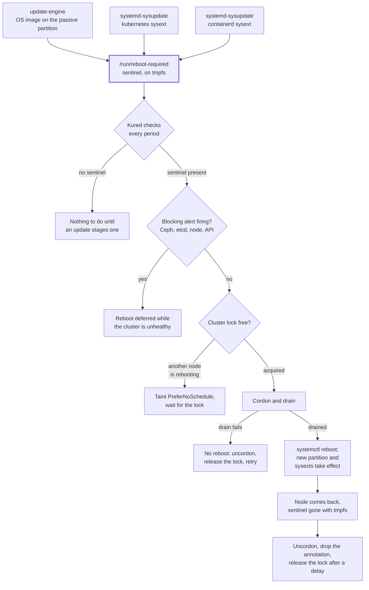

# Kured

[Kured](https://kured.dev/) applies the updates the nodes have staged. It
watches every node for a sentinel file and, when it finds one, takes a
cluster-wide lock, cordons and drains the node, reboots it and uncordons it
when it is back. Flatcar's own `locksmithd` is masked because it reboots
without draining, on a cluster where every node is a storage node.

## At a glance

| | |
| --- | --- |
| Namespace | `kured` |
| Depends on | [Monitoring](monitoring.md) for the alerts it gates on |
| If it is down | Nothing visible: staged OS and sysext updates simply never get applied |
| Health check | `kubectl -n kured logs -l app.kubernetes.io/name=kured --tail=50` |
| Files | `payload/platform/kured/application.yaml` |

## Configuration

Three mechanisms stage an update on disk, and all three signal it by touching
`/run/reboot-required`, Kured's default sentinel. `/run` is tmpfs, so the
marker clears itself on reboot.

| Mechanism | Stages | Signals by |
| --- | --- | --- |
| Flatcar OS (update-engine) | New image on the passive A/B partition | `flatcar-reboot-sentinel.timer` |
| Kubernetes sysext | New `.raw` under `/opt/extensions/kubernetes` | `systemd-sysupdate` drop-in |
| containerd sysext | New `.raw` under `/opt/extensions/containerd` | Same |



The values are in `payload/platform/kured/application.yaml`; the reasoning:

| Setting | Why |
| --- | --- |
| No reboot window | Kured acts as soon as it sees a sentinel; the guards below make that safe, not the clock |
| `concurrency` of one and `lockReleaseDelay` | One node down at a time, with breathing room for Ceph to backfill before the next |
| `forceReboot: false` | A node that will not drain is a node worth looking at |
| `preferNoScheduleTaint` | A node pending reboot stops attracting pods about to be evicted again |
| `annotateNodes: true` | `kubectl get node -o yaml` shows why a node is cordoned |
| `alertFilterRegexp` with `alertFilterMatchOnly: true` | Kured asks Prometheus before taking a node down and refuses while any Ceph, etcd, node or API alert on the list fires. This is the automated "confirm Ceph has recovered" step from [Rebooting a node](../operations/nodes.md): a second reboot during a backfill can take a placement group below its minimum replica count |

!!! note "The regex means the opposite of what it looks like"
    `alertFilterRegexp` normally lists alerts to **ignore**. With `alertFilterMatchOnly: true` these become the only alerts that block, because something is almost always firing in a homelab and blocking on any alert would mean never rebooting. An alert not on the list does not stop a reboot, so widen it if something turns out to matter — and read the flag twice before editing it.

## Usage

To stop Kured rebooting anything without uninstalling it, remove the sentinel
or scale the DaemonSet to zero. To force a node to reboot on the next pass:

```bash
ssh core@<node> sudo touch /run/reboot-required
```

## Health check

```bash
# Which nodes want a reboot
kubectl get nodes -o json | jq -r '.items[] | select(.metadata.annotations["weave.works/kured-reboot-in-progress"]) | .metadata.name'

# Whether a node has staged anything
ssh core@<node> 'ls -l /run/reboot-required; update_engine_client -status'

kubectl -n kured logs -l app.kubernetes.io/name=kured --tail=50
```
