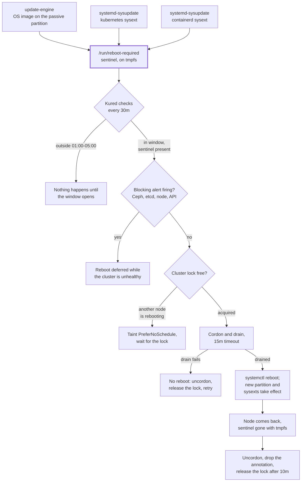

# Kured

[Kured](https://kured.dev/) is what finally applies the updates this cluster has
been staging. It watches every node for a sentinel file, and when it finds one:
takes a cluster-wide lock, cordons the node, drains it, reboots it, waits for it
to come back, and uncordons it.

In other words, it does at 02:00 what you would otherwise do by hand on a
Saturday, in the same order, without getting bored on node four and skipping the
Ceph check.

## The gap it closes

Three mechanisms update a node. All three stop at the same place — the change
lands on disk, and only a reboot applies it:

| Mechanism | Stages | Signals by |
| --- | --- | --- |
| Flatcar OS (update-engine) | New image on the passive A/B partition | `flatcar-reboot-sentinel.timer` touching `/run/reboot-required` |
| Kubernetes sysext | New `.raw` under `/opt/extensions/kubernetes` | `systemd-sysupdate` drop-in touching the same file |
| containerd sysext | New `.raw` under `/opt/extensions/containerd` | Same |

`locksmithd` — the Flatcar daemon that would normally coordinate reboots — is
masked, because it reboots without draining. On a cluster where every node is
also a storage node, "reboots without draining" is a phrase that should raise
your pulse slightly. Kured replaces it and drains first.

All three paths converge on `/run/reboot-required`, which is Kured's default
sentinel. `/run` is tmpfs, so the marker clears itself on reboot; nothing has to
remember to delete it. Small detail, and a genuinely elegant one — a state file
that cannot go stale because the thing that clears it is the thing it is waiting
for.

## The reboot cycle

One pass through the loop, from a staged update to a node serving pods again.
Kured evaluates the window, the sentinel, the alerts and the lock in that order,
so a node that is not allowed to reboot never contends for the lock. Every dead
end below just means waiting for the next 30-minute check:



Everything down to the sentinel happens on every node regardless; Kured is what
reads the file and acts on it.

## Configuration

| Setting | Value | Why |
| --- | --- | --- |
| Window | 01:00–05:00, `Europe/Berlin` | Reboots happen while nobody is using the cluster |
| Check period | 30m | |
| Concurrency | 1 | One node down at a time, never two |
| `lockReleaseDelay` | 10m | Breathing room between nodes for Ceph to backfill |
| `drainTimeout` | 15m | |
| `forceReboot` | `false` | A node that will not drain is a node worth looking at, not a node worth rebooting anyway |
| `preferNoScheduleTaint` | `weave.works/kured-node-reboot` | A node pending reboot stops attracting pods about to be evicted again |

### Asking Prometheus first

The important guard is not the delay, it is the alert check. A fixed delay
assumes recovery takes a predictable amount of time; asking Prometheus asks the
cluster whether it is actually ready, which is a different and much better
question. Kured queries Prometheus before taking a node down and refuses if
anything matching this fires:

```text
CephClusterErrorState, CephClusterWarningState, CephOSDDown, CephPGsUnhealthy,
CephPGsDegraded, CephPGsNotDeepScrubbed, CephMonQuorumAtRisk, CephMonQuorumLost,
CephNodeDown, etcdMembersDown, etcdInsufficientMembers, etcdNoLeader,
KubeNodeNotReady, KubeAPIDown
```

This is the automated form of the "confirm Ceph has recovered before moving on"
step in [Rebooting a node](../operations/index.md#rebooting-a-node): rebooting a
second node while a placement group is still backfilling can take it below its
minimum replica count. Which is to say — this list is what stands between a
routine patch night and an unplanned lesson in Ceph recovery.

!!! note "The regex means the opposite of what it looks like"
    `alertFilterRegexp` normally lists alerts to **ignore**. With `alertFilterMatchOnly: true` the meaning inverts: these become the only alerts that block. That is deliberate — something is almost always firing in a homelab, and blocking on *any* alert would mean never rebooting at all, which is exactly the state this component exists to fix. The flip side is that an alert not on this list will not stop a reboot: the list is the judgement call, so widen it if something turns out to matter. Read the flag twice before editing it; getting this inverted means either nothing ever reboots or everything reboots regardless.

## Watching it work

```bash
# Which nodes want a reboot
kubectl get nodes -o json | jq -r '.items[] | select(.metadata.annotations["weave.works/kured-reboot-in-progress"]) | .metadata.name'

# Whether a node has staged anything
ssh core@<node> 'ls -l /run/reboot-required; update_engine_client -status'

kubectl -n kured logs -l app.kubernetes.io/name=kured --tail=50
```

To stop Kured rebooting anything without uninstalling it — before a holiday, say,
or while something fragile is mid-migration — remove the sentinel or scale the
DaemonSet to zero. To force a node to reboot on the next pass:

```bash
ssh core@<node> sudo touch /run/reboot-required
```

## Directory Structure

```text
kured/
└── application.yaml   # ArgoCD Application (Helm: kured)
```
