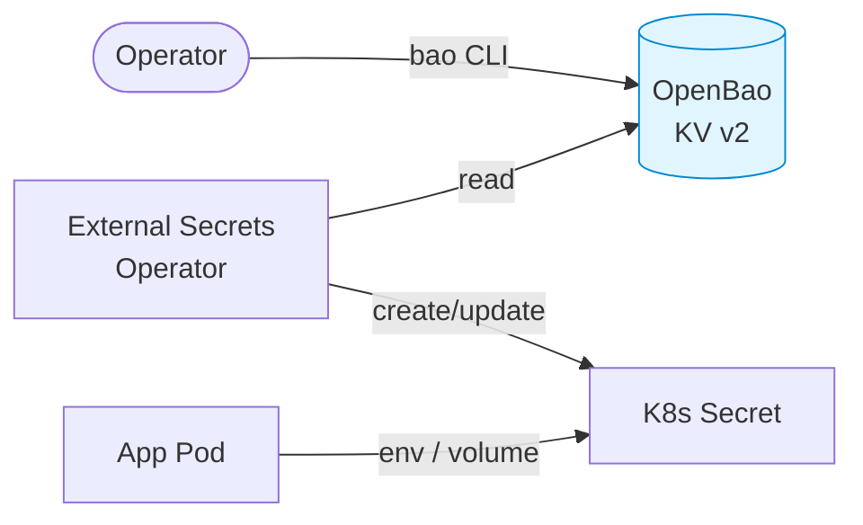

# OpenBao

[OpenBao](https://openbao.org/) is the cluster's secret store — an open-source, Linux Foundation fork of HashiCorp Vault. It holds every secret consumed by workloads on the cluster (cloud credentials, API tokens, registry pulls, database passwords, …). Secrets are surfaced to Kubernetes as native `Secret` objects via the [External Secrets Operator](external-secrets.md).

It is also the single most consequential component on this cluster. When
OpenBao is unhappy, nothing that needs a credential works, and the failure
presents as six unrelated things breaking at once. Learn its two states —
sealed and unsealed — before you need to.



## Architecture

| Property           | Value                                                       |
|--------------------|-------------------------------------------------------------|
| Mode               | HA, 3 replicas                                              |
| Storage backend    | Integrated Raft (`/openbao/data`, Ceph PVC per replica)     |
| Audit storage      | Enabled, separate PVC on `rook-ceph-block`                  |
| TLS                | Disabled inside the cluster — TLS terminates at the Gateway |
| UI                 | `https://vault.infra.k8s.wlkr.ch`                           |
| In-cluster service | `http://openbao.openbao.svc.cluster.local:8200`             |
| Seal               | Shamir — 5 key shares, threshold 3, unsealed by hand        |

The chart is the official upstream [`openbao/openbao-helm`](https://github.com/openbao/openbao-helm), pinned in `application.yaml`.

## Bootstrap

OpenBao is sync-wave `0` — it starts after cert-manager (`-5`), Cilium (`-1`), and the Rook-Ceph cluster (`-1`). ArgoCD provisions the StatefulSet, PVCs, Services, and the `vault.infra.k8s.wlkr.ch` HTTPRoute. The pods will be `Running` but **not Ready** until the cluster is initialised and unsealed. Neither happens on its own: initialisation is a one-time manual step, and unsealing is a manual step you will repeat after every restart.

### 1. Initialise the cluster (one-time)

```bash
kubectl -n openbao exec -it openbao-0 -- bao operator init \
  -key-shares=5 \
  -key-threshold=3
```

The command prints **5 unseal keys** and an **initial root token**. Store them in a password manager, right now, before you run another command. Not in the terminal scrollback. Not in a note you will "tidy up later". Losing all 5 keys means the data is unrecoverable, and OpenBao is not being dramatic about that — there is no support line, no recovery flow, and no clever trick. There is just the ciphertext and no way in.

!!! danger
    These keys protect every other secret on the cluster. They are written **once**, to the operator's terminal. There is no backup, no second chance, and no amount of Ceph replication that helps. Treat them like the root credentials they are, and keep them somewhere that does not require this cluster to be running in order to read.

### 2. Unseal each replica

The seal is Shamir, so nothing unseals these pods but you. Repeat for
`openbao-0`, `openbao-1`, `openbao-2`, providing 3 of the 5 keys each time:

```bash
for pod in openbao-0 openbao-1 openbao-2; do
  for i in 1 2 3; do
    kubectl -n openbao exec -it "$pod" -- bao operator unseal
  done
done
```

Three of five, three times, once per pod. Yes, it is tedious — that tedium is the entire security model, and it is the price of keeping the key material off every machine but yours. Once the first pod is unsealed and joined the cluster's other replicas auto-join via the Kubernetes service registration. Confirm with:

```bash
kubectl -n openbao exec -it openbao-0 -- bao status
```

You should see `Initialized: true`, `Sealed: false`, `HA Mode: active` on one pod and `standby` on the others.

### 3. Authenticate locally

For convenience, port-forward and point the CLI at the local instance:

```bash
kubectl -n openbao port-forward svc/openbao 8200:8200 &
export BAO_ADDR=http://127.0.0.1:8200
bao login   # paste the root token
```

The remaining steps assume `bao` is configured this way.

## Secret engine

A single KV v2 engine is mounted at the path `kv/`. All cluster secrets live under it. One engine, one convention, no debates six months from now about whether it was `kv/` or `secret/`.

```bash
bao secrets enable -path=kv -version=2 kv
```

### Layout convention

```text
kv/
├── authentik/
│   └── config             # secret-key, postgres-password, bootstrap-password,
│                          # bootstrap-token, and the client id/secret pairs
│                          # ArgoCD and Grafana read back from here
├── cert-manager/
│   └── route53            # access-key-id, secret-access-key
├── external-dns/
│   └── route53            # access-key-id, secret-access-key
├── monitoring/
│   └── smtp               # password
└── <workload>/<purpose>   # one leaf per secret
```

Four paths, six [ExternalSecrets](external-secrets.md): `authentik/config` is
read by three of them, because generating the OIDC client credentials up front
is what keeps both sides of each integration declarative. The two `route53`
leaves are deliberately separate and meant to be separate IAM users --
cert-manager only writes `_acme-challenge` TXT records, while external-dns can
repoint hostnames. Anything added later follows the same `<workload>/<purpose>`
shape.

The `bao kv put` for each path lives in a comment at the top of the
`ExternalSecret` that consumes it, which is the list to trust; they are
collected in [Quickstart step 11](../quickstart.md).

Each leaf is a single secret with one or more keys. ExternalSecret resources reference paths as `cert-manager/route53` (the KV v2 `data/` prefix is added by ESO automatically).

### Storing a secret

```bash
bao kv put kv/cert-manager/route53 \
  access-key-id="AKIA..." \
  secret-access-key="..."
```

### Reading a secret

```bash
bao kv get kv/cert-manager/route53
```

## Kubernetes auth method

External Secrets Operator authenticates to OpenBao using ServiceAccount JWTs. Set this up once after init:

```bash
# Enable the auth method
bao auth enable kubernetes

# Tell OpenBao how to reach the cluster's TokenReview API. The CA cert
# and host are read from the in-cluster ServiceAccount projection.
bao write auth/kubernetes/config \
  kubernetes_host="https://kubernetes.default.svc"
```

The OpenBao ServiceAccount (`openbao` in namespace `openbao`) already has the `system:auth-delegator` ClusterRole bound to it via `rbac.yaml` in this directory, so the TokenReview calls succeed without additional setup.

### Policy for ESO

```bash
bao policy write external-secrets - <<'EOF'
path "kv/data/*" {
  capabilities = ["read"]
}
path "kv/metadata/*" {
  capabilities = ["read", "list"]
}
EOF
```

### Role binding ESO's ServiceAccount

```bash
bao write auth/kubernetes/role/external-secrets \
  bound_service_account_names=external-secrets-vault \
  bound_service_account_namespaces=external-secrets \
  policies=external-secrets \
  ttl=1h
```

The `external-secrets-vault` ServiceAccount is created by `payload/platform/external-secrets/cluster-secret-store.yaml` — see [External Secrets](external-secrets.md).

Once this is done, ExternalSecret resources cluster-wide will resolve. Verify with:

```bash
kubectl get externalsecret -A
kubectl get clustersecretstore openbao -o yaml
```

The `Status.Conditions` of the `ClusterSecretStore` should report `Ready=True`.

## Unsealing after a restart

OpenBao seals itself on every pod restart — every node reboot, every ArgoCD upgrade, every chart bump, every time a kubelet has a bad day. This is by design and it is not going to stop:

```bash
for pod in openbao-0 openbao-1 openbao-2; do
  kubectl -n openbao get pod "$pod" -o jsonpath='{.status.containerStatuses[0].ready}' | \
    grep -q true || \
    for i in 1 2 3; do
      kubectl -n openbao exec -it "$pod" -- bao operator unseal
    done
done
```

Nothing does this for you. There is no auto-unseal seal configured, so a
reboot at 03:00 leaves the cluster running and its secret store shut until
someone with the key shares logs in. Plan for that rather than being surprised
by it: while OpenBao is sealed no `ExternalSecret` resolves, so cert-manager
loses the Route53 credentials it needs to renew certificates.

The failure is slow, which is what makes it dangerous. Nothing breaks the day
OpenBao seals; things break sixty days later when a certificate expires and
nobody connects the two events. See
[OpenBao needs an operator to unseal it](../architecture/limitations.md#openbao-needs-an-operator-to-unseal-it).

## Backups

The Raft storage backend supports snapshotting:

```bash
bao operator raft snapshot save snapshot.bao
```

Snapshots include all KV data and OpenBao's own config (policies, roles, mounts). Store them off-cluster — a snapshot on a PVC inside the cluster it is meant to rebuild is decoration. Restore with `bao operator raft snapshot restore`. And note the obvious: the snapshot is encrypted with a key that exists only in those five shares, so it is exactly as recoverable as your key custody is.

## Directory Structure

```text
openbao/
├── application.yaml                # ArgoCD Application (Helm: openbao/openbao)
├── httproute.yaml                  # vault.infra.k8s.wlkr.ch
└── rbac.yaml                       # system:auth-delegator binding for the openbao SA
```
