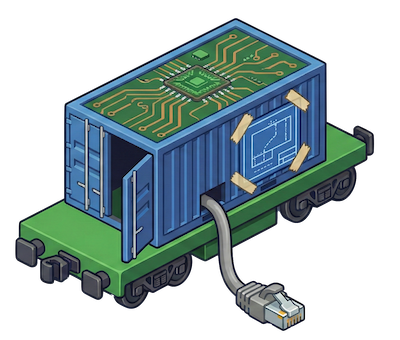

# Quickstart

{ align=right width=150 }

Bring up the bare metal Kubernetes cluster from scratch. This project automates
the deployment using Flatcar Container Linux and Kubeadm.

Set aside an afternoon. Not because the steps are long — they are eleven
commands — but because somewhere around step 7 a machine will sit at a blinking
cursor, and you will learn something about your DHCP server that you did not
want to know.

!!! warning "Read this first if the cluster isn't mine"
    This repository describes a specific homelab. Node names, IP addresses, the `wlkr.ch` domain, and the Git repository URL are hardcoded throughout `payload/`. Following the steps below verbatim gives you a cluster whose ArgoCD syncs from **this** repository and whose certificates are issued for a domain you don't control. Work through [Adapting This for Your Cluster](adapting.md) **before** step 1.

## Hardware Requirements

Each node must have:

- A NIC that supports PXE booting
- An NVMe drive (or adjust `install_disk` in `inventory.yaml` — one node uses `/dev/sda`, because hardware is a collection of exceptions wearing a trenchcoat)
- Sufficient disk space: 50 GB reserved for containerd, remainder used by Rook-Ceph as OSD storage

The deployment host (the machine running Ansible and the boot server) must be reachable from the nodes on the same L2 network segment.

## Prerequisites

### Tools on the deployment host

| Tool | Used by | Install |
| --- | --- | --- |
| `make` | every step | Xcode CLT / `build-essential` |
| `git` | cloning this repository | your package manager |
| `uv` | Ansible and the boot server | `curl -LsSf https://astral.sh/uv/install.sh \| sh` |
| `butane` | transpiling Butane YAML to Ignition JSON | `brew install butane` or the [Flatcar docs](https://www.flatcar.org/docs/latest/provisioning/config-transpiler/) |
| `kubectl` | steps 8 onwards | [kubernetes.io](https://kubernetes.io/docs/tasks/tools/) |
| `helm` | `make install-core`, `make install-argo` | [helm.sh](https://helm.sh/docs/intro/install/) |
| `sudo` | `make serve` binds privileged port 69 | — |

### Other requirements

- **SSH Key**: An Ed25519 key at `~/.ssh/id_ed25519.pub` (or edit `ansible/templates/butane_config.yaml.j2` to use a different path/key)
- **External DHCP Server**: Must point PXE clients at the deployment host:
  - Option 66 (`next-server`): IP of the machine running `make serve`
  - Option 67 (`filename`): `lpxelinux.0` for BIOS, `syslinux.efi` for UEFI

!!! tip "Consumer routers and PXE"
    Plenty of home routers will happily let you set options 66 and 67 and then serve neither. If step 7 produces total silence in the boot server log, prove the DHCP side first with `tcpdump -i <iface> port 67 or port 68` before you go looking for bugs in anything more interesting.

## Setup

1. **Clone Repository**:

    ```bash
    git clone https://github.com/JanWelker/homelab.git homelab
    cd homelab
    ```

2. **Configure Inventory**:
    Edit `ansible/inventory.yaml` to define your target nodes and settings.

    | Variable | Why it matters |
    | --- | --- |
    | `boot_server_ip` | **Most commonly missed.** Baked into the generated PXE menu as the URL for the kernel, initrd, and Ignition config. If this isn't the IP of the machine that will run `make serve`, nodes load the bootloader and then hang. |
    | `mac_address` (per host) | Selects which generated PXE menu a node picks up |
    | `ansible_host` (per host) | The static IP the node is given |
    | `install_disk` | Target disk for the Flatcar install (`/dev/nvme0n1` by default) |
    | `kubernetes_version`, `containerd_version`, `flatcar_version` | Artifact versions to download |

3. **Initialize Environment**:
    Initialize the project using `uv` to create the virtual environment and install dependencies:

    ```bash
    make setup
    ```

4. **Download Artifacts**:

    ```bash
    make download
    ```

    *Downloads Flatcar artifacts, Syslinux, and Systemd Sysext images
    (Kubernetes, Containerd) to `output/http`.*

5. **Generate Configurations**:

    ```bash
    make config
    ```

    *Artifacts will be generated in `output/http` (Ignition) and `output/tftp`
    (PXE). Note: The install disk is partitioned into 50GB for containerd and the
    remaining space for Rook-Ceph storage.*

    Re-run this after **any** change to `inventory.yaml` — the values are baked
    into the generated files. Editing the inventory and skipping this step is the
    homelab equivalent of changing the config and forgetting to reload the
    service, and it fails just as quietly. `make artifacts` runs steps 4 and 5
    together.

    Check that one PXE menu was generated per node:

    ```bash
    ls output/tftp/pxelinux.cfg/     # one 01-<mac> file per host
    ```

6. **Start Boot Server** (Requires sudo for port 69):

    ```bash
    make serve
    ```

    Leave this running for the whole of step 7 — it serves every artifact the
    nodes fetch. It logs each TFTP and HTTP request, which is the best signal
    that a node is progressing. Keep the window visible: watching those requests
    arrive in order is the single most useful debugging tool in this entire
    procedure.

7. **Boot Machines**:
    Power on your bare metal nodes. They will PXE boot, install Flatcar, and reboot.
    - Expect the boot server log to show, per node: a TFTP request for the
      bootloader and its `01-<mac>` menu, then HTTP requests for the kernel,
      the initrd, `ignition-<host>.json`, and finally the sysext images.
    - **Note**: The cluster will come up in a `NotReady` state initially because
      no CNI is installed. This is correct. Do not fix it yet.
    - If a node stalls, see [Troubleshooting PXE boot](#troubleshooting-pxe-boot).

8. **Retrieve Kubeconfig**:
    Once the control plane node responds to SSH (or is pingable), retrieve the
    admin kubeconfig:

    ```bash
    make kubeconfig
    ```

    Verify the cluster answers. `NotReady` is expected at this point:

    ```bash
    export KUBECONFIG="$PWD/output/kubeconfig"
    kubectl get nodes
    ```

    *Optional: Install to local machine (will not overwrite existing config):*

    ```bash
    mkdir -p ~/.kube
    cp -n output/kubeconfig ~/.kube/config
    ```

9. **Install Core Components** (CRITICAL):
    With `output/kubeconfig` in place (`kubeadm` likely finished):

    ```bash
    make install-core
    ```

    - Installs the Gateway API CRDs, then **Cilium** (CNI, Ingress, L2
      Announcements) via Helm.
    - **Removes** `kube-proxy` to resolve IPVS conflicts.
    - Installs **cert-manager** (for ACME TLS) and the Let's Encrypt
      ClusterIssuers.

    !!! note
        This target pins its own Cilium, cert-manager, and Gateway API CRD versions directly in the `Makefile`, because it runs before ArgoCD exists. Those pins are separate from the ones ArgoCD manages in `payload/platform/` and are not updated by Renovate — check them if a component behaves differently before and after the GitOps handover.

    Nodes should reach `Ready` once Cilium is up:

    ```bash
    kubectl -n kube-system rollout status ds/cilium
    kubectl get nodes                  # all Ready
    ```

10. **Post-Installation**:

    - **Deploy ArgoCD**:

        ```bash
        make install-argo
        ```

        The Gateway and DNS for `argo.infra.k8s.wlkr.ch` don't work yet, so
        reach the UI by port-forward and log in as `admin`:

        ```bash
        kubectl -n argocd get secret argocd-initial-admin-secret \
          -o jsonpath='{.data.password}' | base64 -d; echo
        kubectl -n argocd port-forward svc/argocd-server 8080:80
        # http://localhost:8080
        ```

    - **Bootstrap GitOps** (App-of-Apps):

        ```bash
        make bootstrap-apps
        ```

        *This applies the parent applications (platform, gitops)
        which enable ArgoCD to manage all applications from Git.*

        This is the handover moment: from here on the cluster takes its orders
        from the repository rather than from you. Watch the platform sync.
        Applications appear in [sync-wave order](platform/index.md#usage):

        ```bash
        kubectl -n argocd get applications -w
        ```

        The `Certificate` resources stay un-Ready until step 11 — that is
        expected, since their Route53 credentials don't exist yet.

11. **Initialise the secret store**:
    OpenBao starts uninitialised and empty. Until it is initialised and
    populated, cert-manager cannot issue certificates (the Route53 credentials
    live in OpenBao). This step assumes the `openbao-kms` Secret already exists
    — it is applied by hand from `kms-credentials.yaml.template` and is what
    lets OpenBao unseal itself at all. Follow
    [OpenBao &rarr; Bootstrap](platform/openbao.md#bootstrap) end-to-end:

    1. `bao operator init` on `openbao-0` and securely store the recovery keys + root token. "Securely" means a password manager, not a terminal scrollback you will close in an hour.
    2. Confirm all three replicas came up unsealed (`bao status`). With the KMS seal in place they unseal themselves; if they did not, KMS is unreachable and you unseal by hand with 3 of the 5 keys.
    3. Enable the `kv` v2 secret engine, the Kubernetes auth method, and the `external-secrets` policy/role (see [OpenBao &rarr; Kubernetes auth method](platform/openbao.md#kubernetes-auth-method)).
    4. Store the Route53 credentials:

        ```bash
        bao kv put kv/cert-manager/route53 \
          access-key-id="$AWS_ACCESS_KEY_ID" \
          secret-access-key="$AWS_SECRET_ACCESS_KEY"
        ```

    Cert-manager will then pick up the materialised Secret and issue the
    gateway certificates.

## Single-node clusters

The [documented layout](architecture/index.md#cluster-layout) has dedicated
worker nodes, so the control-plane taint stays in place. If you are instead
running everything on one node, remove the taint after step 9 so workloads can
schedule:

```bash
make untaint
```

Re-apply it when you later add worker nodes:

```bash
make taint
```

## Verifying the result

The four commands that answer "is it actually fine?":

```bash
kubectl get nodes                                  # all Ready
kubectl -n argocd get applications                 # all Synced / Healthy
kubectl get certificate -A                         # READY=True
kubectl -n rook-ceph get cephcluster               # HEALTH_OK
```

Once DNS points at the gateway IPs, the platform UIs are reachable — see
[Platform &rarr; HTTPRoute Locations](platform/index.md#httproute-locations).

## Troubleshooting PXE boot

Step 7 is the most failure-prone part of the process, and it fails in a
particularly demoralising way: a black screen with a blinking cursor and no
error message. The trick is to stop staring at the node and start reading the
`make serve` log, asking one question — how far did it get?

| Symptom | Likely cause |
| --- | --- |
| Node never requests anything; no log output at all | DHCP isn't handing out options 66/67, or the node isn't on the same L2 segment. Check the DHCP lease and that PXE is enabled in firmware. |
| `PXE-E32: TFTP open timeout` | `make serve` isn't running, or a firewall is blocking UDP/69. On macOS, allow the Python interpreter through the firewall. |
| Bootloader loads, then "Could not find kernel image" or a hang at the menu | `boot_server_ip` in `inventory.yaml` is wrong. It is baked into the menu's kernel/initrd URLs. Fix it, re-run `make config`, and reboot the node. |
| TFTP requests arrive but no `01-<mac>` file is served | The node's `mac_address` in `inventory.yaml` doesn't match its actual NIC. Compare against `ls output/tftp/pxelinux.cfg/`. |
| Kernel boots, then Ignition fails | The node couldn't fetch `ignition-<host>.json` over HTTP (port 8000), or the Butane template references an SSH key path that doesn't exist. |
| Node installs but never joins the cluster | Sysext download failed, or the kubeadm systemd unit errored. SSH in as `core` and check `journalctl -u kubeadm`. |

Two things worth internalising. A machine with two NICs will PXE boot from
whichever one it feels like, and the MAC printed on the case is frequently not
that one. And a node that boots the menu but stalls immediately after is almost
never a broken image — it is `boot_server_ip`, pointing at an address that was
correct on some other network, on some other day.

The boot server serves `output/tftp` over TFTP and `output/http` over HTTP —
see [Boot Server](boot_server/index.md). If a file is missing from those
directories, re-run `make artifacts`.
