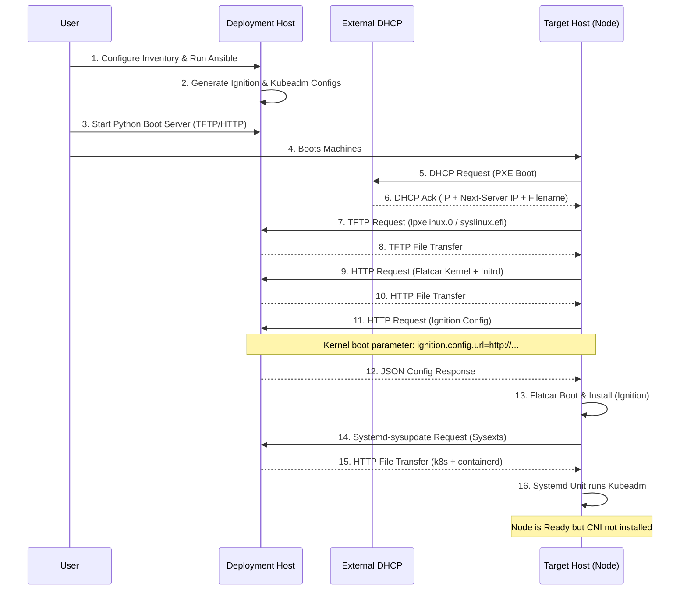
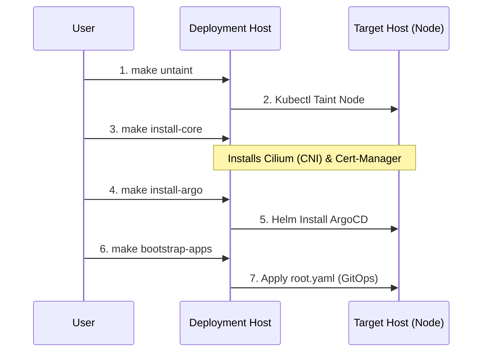

# Boot & Bootstrap Process

This document details the flow of data from the initial PXE boot to a fully operational Kubernetes node.

## 1. Initial Provisioning (PXE + Ignition)

## 2. Post-Installation Bootstrap

Once the OS is installed and Kubeadm has initialized the node, we manually trigger the bootstrap of cluster components.

