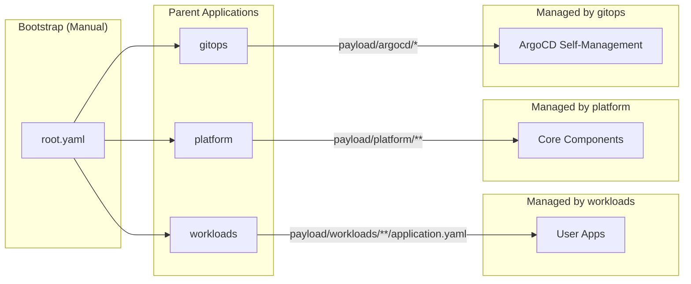
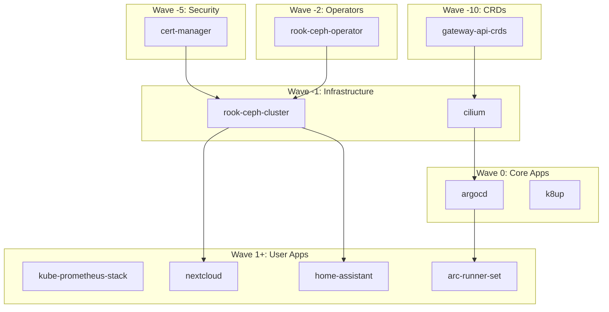

# GitOps Strategy

We use **ArgoCD** to manage the cluster state declaratively.

## App-of-Apps Pattern

We use a hierarchical Application structure to manage dependencies and logical grouping.

## Deployment Waves

ArgoCD uses **sync waves** to control deployment order. Lower waves sync first.
This ensures CRDs exist before Operators, and Storage exists before
Applications.

