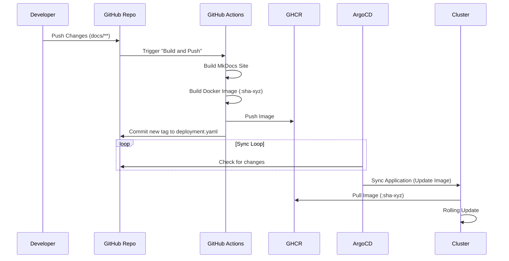

# Documentation System

The project documentation (this site) is self-hosted and automatically updated
via a CI/CD pipeline that integrates with ArgoCD.

## Workflow

1. **Authoring**: Documentation is written in Markdown within `payload/workloads/documentation/src/docs`.
2. **Build**: On push to `main`, a GitHub Action builds the static site using
    MkDocs and packages it into an Nginx-based Docker image.
3. **Versioning**: The image is tagged with the short Git SHA (e.g.,
    `:sha-a1b2c3d`) to ensure immutability.
4. **GitOps Update**: The GitHub Action **commits** this new image tag back to
    the `deployment.yaml` file in the repository.
5. **Deployment**: ArgoCD detects the change in the manifest and automatically
    syncs the new image to the cluster.

