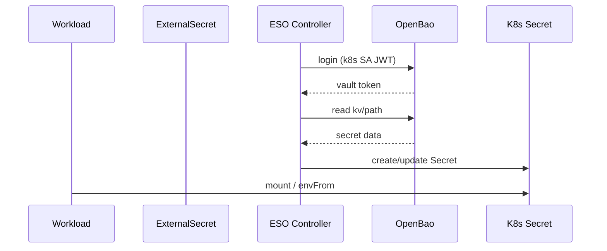

# External Secrets Operator

[External Secrets Operator (ESO)](https://external-secrets.io/) bridges the cluster's secret store ([OpenBao](openbao.md)) to native Kubernetes `Secret` objects. Workloads consume secrets the standard way (`envFrom`, `volumeMounts`, `imagePullSecrets`) without ever talking to OpenBao directly.

## Components

| Resource              | Scope        | Purpose                                                |
|-----------------------|--------------|--------------------------------------------------------|
| `external-secrets`    | Deployment   | Reconciler that watches ExternalSecret objects         |
| `ClusterSecretStore`  | Cluster      | Single store named `openbao` shared by all namespaces  |
| `ExternalSecret`      | Namespaced   | One per Secret you want materialised in a namespace    |

## How it works



ESO authenticates to OpenBao with its own ServiceAccount (`external-secrets-vault` in the `external-secrets` namespace). OpenBao validates the JWT against the Kubernetes TokenReview API and issues a short-lived OpenBao token bound to the `external-secrets` role/policy.

## Adding a new secret

The full round-trip from "I have a new credential" to "my Pod can read it":

### 1. Store the value in OpenBao

```bash
bao kv put kv/<workload>/<purpose> \
  key1="value1" \
  key2="value2"
```

Pick a path that follows the layout in [OpenBao &rarr; Layout convention](openbao.md#layout-convention).

### 2. Declare an `ExternalSecret` in the workload's directory

```yaml
---
apiVersion: external-secrets.io/v1
kind: ExternalSecret
metadata:
  name: my-app-credentials
  namespace: my-app
  annotations:
    # ESO CRDs install at sync-wave 1. If your Application syncs earlier,
    # this annotation prevents ArgoCD from failing the dry-run.
    argocd.argoproj.io/sync-options: SkipDryRunOnMissingResource=true
spec:
  refreshInterval: 1h
  secretStoreRef:
    name: openbao
    kind: ClusterSecretStore
  target:
    name: my-app-credentials   # name of the resulting K8s Secret
    creationPolicy: Owner
  data:
    - secretKey: key1           # key in the K8s Secret
      remoteRef:
        key: <workload>/<purpose>
        property: key1          # key inside the KV entry
    - secretKey: key2
      remoteRef:
        key: <workload>/<purpose>
        property: key2
```

Drop the file alongside the workload's other manifests (`deployment.yaml`, `service.yaml`, …). The parent ArgoCD Application picks it up automatically.

### 3. Consume the Secret

```yaml
spec:
  containers:
    - name: my-app
      envFrom:
        - secretRef:
            name: my-app-credentials
```

The Secret name in `target.name` is what shows up in the namespace.

## Pulling whole secrets

To pull every key from a KV entry without listing them individually:

```yaml
spec:
  dataFrom:
    - extract:
        key: <workload>/<purpose>
```

## Refresh interval

`refreshInterval: 1h` polls OpenBao hourly. Set to `0` to disable polling — ESO will only re-sync on resource changes. For rotated credentials, leave it at a value that matches your rotation cadence.

## Troubleshooting

### `ClusterSecretStore` is not Ready

```bash
kubectl get clustersecretstore openbao -o jsonpath='{.status}' | jq
```

Common causes:

- OpenBao is sealed (`bao status` &rarr; `Sealed: true`) — unseal it, see [OpenBao &rarr; Unsealing](openbao.md#unsealing-after-a-restart).
- Kubernetes auth role missing — re-run the `bao write auth/kubernetes/role/external-secrets …` command.
- Wrong `serviceAccountRef` — must point to `external-secrets-vault` in the `external-secrets` namespace.

### An `ExternalSecret` is not Synced

```bash
kubectl describe externalsecret -n <namespace> <name>
```

Common causes:

- The KV path doesn't exist (`bao kv get kv/<path>` returns 404). Store the secret first.
- The `property:` doesn't match a key in the KV entry. List keys with `bao kv get kv/<path>`.
- Policy doesn't grant `read` on the path. Edit the `external-secrets` policy.

### Force a re-sync

```bash
kubectl annotate externalsecret -n <namespace> <name> \
  force-sync=$(date +%s) --overwrite
```

## Directory Structure

```text
external-secrets/
├── application.yaml          # ArgoCD Application (Helm: external-secrets)
└── cluster-secret-store.yaml # ServiceAccount, RBAC, ClusterSecretStore
```
