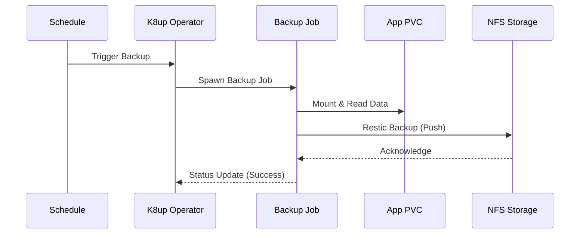

# K8up Backup System

K8up is a Kubernetes backup operator that uses Restic to backup PVCs.

## Configuration

- **Operator**: Deployed via Helm chart in `k8up-system` namespace
- **Backend**: Local storage using NFS PersistentVolume
- **Schedule**: Daily backups at 2 AM, weekly checks, monthly pruning

## Storage

The backup storage uses a separate 500Gi NFS-backed PVC (`k8up-backup-storage`).

**Configuration Required**: Update `nfs-provisioner.yaml` with your NFS server details:

- `server`: Your NFS server IP address
- `path`: NFS export path for backup storage (e.g., `/mnt/storage/k8up-backups`)

## Backup Schedule

The `schedule.yaml` defines automated backup operations:

- **Backup**: Daily at 2:00 AM
- **Check**: Weekly on Sundays at 3:00 AM (repository integrity)
- **Prune**: Monthly on the 1st at 4:00 AM

### Retention Policy

- Last 5 backups
- Daily backups for 14 days
- Weekly backups for 8 weeks
- Monthly backups for 6 months

### Backup Flow

## Security

The Restic repository password is stored in the `backup-repo-password` secret.

**IMPORTANT**: Change the default password in `backup-repo-password.yaml` before
deploying to production!

## Per-Application Backups

To create backups for specific applications, create a `Schedule` resource in the
application's namespace with the same backend configuration. See the k8up
documentation for examples.
