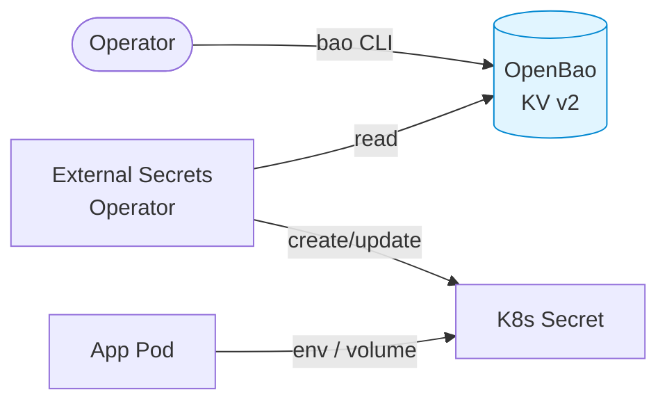

# OpenBao

[OpenBao](https://openbao.org/) is the cluster's secret store — an open-source, Linux Foundation fork of HashiCorp Vault. It holds every secret consumed by workloads on the cluster (cloud credentials, API tokens, registry pulls, database passwords, …). Secrets are surfaced to Kubernetes as native `Secret` objects via the [External Secrets Operator](external-secrets.md).



## Architecture

| Property           | Value                                                       |
|--------------------|-------------------------------------------------------------|
| Mode               | HA, 3 replicas                                              |
| Storage backend    | Integrated Raft (`/openbao/data`, Ceph PVC per replica)     |
| Audit storage      | Enabled, separate PVC on `rook-ceph-block`                  |
| TLS                | Disabled inside the cluster — TLS terminates at the Gateway |
| UI                 | `https://vault.infra.k8s.wlkr.ch`                           |
| In-cluster service | `http://openbao.openbao.svc.cluster.local:8200`             |
| Auto-unseal        | **Not configured** — manual unseal after every restart      |

The chart is the official upstream [`openbao/openbao-helm`](https://github.com/openbao/openbao-helm), pinned in `application.yaml`.

## Bootstrap

OpenBao is sync-wave `0` — it starts after cert-manager (`-5`), Cilium (`-1`), and the Rook-Ceph cluster (`-1`). ArgoCD provisions the StatefulSet, PVCs, Services, and the `vault.infra.k8s.wlkr.ch` HTTPRoute. The pods will be `Running` but **not Ready** until the cluster is initialised and unsealed.

### 1. Initialise the cluster (one-time)

```bash
kubectl -n openbao exec -it openbao-0 -- bao operator init \
  -key-shares=5 \
  -key-threshold=3
```

The command prints **5 unseal keys** and an **initial root token**. Store them in a password manager — losing all 5 keys means the data is unrecoverable.

!!! danger
    These keys protect every other secret on the cluster. They are written **once**, to the operator's terminal. There is no backup. Treat them like the root credentials they are.

### 2. Unseal each replica

Repeat for `openbao-0`, `openbao-1`, `openbao-2`, providing 3 of the 5 keys each time:

```bash
for pod in openbao-0 openbao-1 openbao-2; do
  for i in 1 2 3; do
    kubectl -n openbao exec -it "$pod" -- bao operator unseal
  done
done
```

Once the first pod is unsealed and joined the cluster's other replicas auto-join via the Kubernetes service registration. Confirm with:

```bash
kubectl -n openbao exec -it openbao-0 -- bao status
```

You should see `Initialized: true`, `Sealed: false`, `HA Mode: active` on one pod and `standby` on the others.

### 3. Authenticate locally

For convenience, port-forward and point the CLI at the local instance:

```bash
kubectl -n openbao port-forward svc/openbao 8200:8200 &
export BAO_ADDR=http://127.0.0.1:8200
bao login   # paste the root token
```

The remaining steps assume `bao` is configured this way.

## Secret engine

We mount a single KV v2 engine at the path `kv/`. All cluster secrets live under it.

```bash
bao secrets enable -path=kv -version=2 kv
```

### Layout convention

```text
kv/
├── cert-manager/
│   └── route53            # access-key-id, secret-access-key
├── monitoring/
│   └── grafana            # admin-user, admin-password
└── <workload>/<purpose>
```

Each leaf is a single secret with one or more keys. ExternalSecret resources reference paths as `cert-manager/route53` (the KV v2 `data/` prefix is added by ESO automatically).

### Storing a secret

```bash
bao kv put kv/cert-manager/route53 \
  access-key-id="AKIA..." \
  secret-access-key="..."
```

### Reading a secret

```bash
bao kv get kv/cert-manager/route53
```

## Kubernetes auth method

External Secrets Operator authenticates to OpenBao using ServiceAccount JWTs. Set this up once after init:

```bash
# Enable the auth method
bao auth enable kubernetes

# Tell OpenBao how to reach the cluster's TokenReview API. The CA cert
# and host are read from the in-cluster ServiceAccount projection.
bao write auth/kubernetes/config \
  kubernetes_host="https://kubernetes.default.svc"
```

The OpenBao ServiceAccount (`openbao` in namespace `openbao`) already has the `system:auth-delegator` ClusterRole bound to it via `rbac.yaml` in this directory, so the TokenReview calls succeed without additional setup.

### Policy for ESO

```bash
bao policy write external-secrets - <<'EOF'
path "kv/data/*" {
  capabilities = ["read"]
}
path "kv/metadata/*" {
  capabilities = ["read", "list"]
}
EOF
```

### Role binding ESO's ServiceAccount

```bash
bao write auth/kubernetes/role/external-secrets \
  bound_service_account_names=external-secrets-vault \
  bound_service_account_namespaces=external-secrets \
  policies=external-secrets \
  ttl=1h
```

The `external-secrets-vault` ServiceAccount is created by `payload/platform/external-secrets/cluster-secret-store.yaml` — see [External Secrets](external-secrets.md).

Once this is done, ExternalSecret resources cluster-wide will resolve. Verify with:

```bash
kubectl get externalsecret -A
kubectl get clustersecretstore openbao -o yaml
```

The `Status.Conditions` of the `ClusterSecretStore` should report `Ready=True`.

## Unsealing after a restart

OpenBao seals itself on every pod restart. After a node reboot, ArgoCD upgrade, or chart bump:

```bash
for pod in openbao-0 openbao-1 openbao-2; do
  kubectl -n openbao get pod "$pod" -o jsonpath='{.status.containerStatuses[0].ready}' | \
    grep -q true || \
    for i in 1 2 3; do
      kubectl -n openbao exec -it "$pod" -- bao operator unseal
    done
done
```

A future improvement is to wire up [auto-unseal](https://openbao.org/docs/concepts/seal/) via a cloud KMS, but the homelab currently accepts the manual step.

## Backups

The Raft storage backend supports snapshotting:

```bash
bao operator raft snapshot save snapshot.bao
```

Snapshots include all KV data and OpenBao's own config (policies, roles, mounts). Store them off-cluster. Restore with `bao operator raft snapshot restore`.

## Directory Structure

```text
openbao/
├── application.yaml   # ArgoCD Application (Helm: openbao/openbao)
├── httproute.yaml     # vault.infra.k8s.wlkr.ch
└── rbac.yaml          # system:auth-delegator binding for the openbao SA
```
