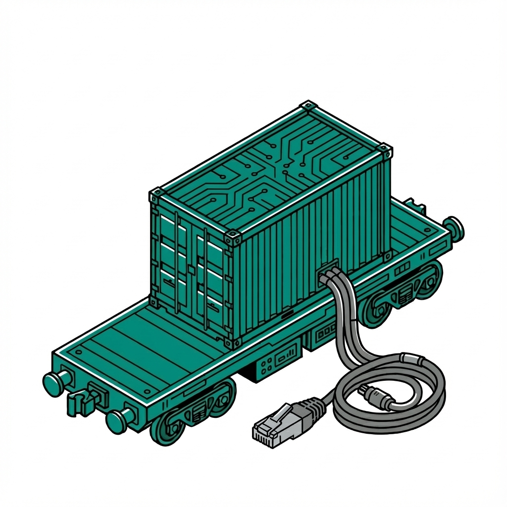

# Bare Metal K8s Deployment

{ align=right width=150 }

This project automates the deployment of a bare metal Kubernetes cluster using
Flatcar Container Linux and Kubeadm.

## Hardware Requirements

Each node must have:

- A NIC that supports PXE booting
- An NVMe drive (or adjust `install_disk` in `inventory.yaml` — one node uses `/dev/sda`)
- Sufficient disk space: 50 GB reserved for containerd, remainder used by Rook-Ceph as OSD storage

The deployment host (the machine running Ansible and the boot server) must be reachable from the nodes on the same L2 network segment.

## Prerequisites

- **uv**: Python package manager (`curl -LsSf https://astral.sh/uv/install.sh | sh`)
- **Butane**: Transpiles YAML configs to Ignition JSON (`brew install butane` or see [Flatcar docs](https://www.flatcar.org/docs/latest/provisioning/config-transpiler/))
- **SSH Key**: An Ed25519 key at `~/.ssh/id_ed25519.pub` (or edit `ansible/templates/butane_config.yaml.j2` to use a different path/key)
- **External DHCP Server**: Must point PXE clients at the deployment host:
  - Option 66 (`next-server`): IP of the machine running `make serve`
  - Option 67 (`filename`): `lpxelinux.0` for BIOS, `syslinux.efi` for UEFI

## Setup

1. **Clone Repository**:

    ```bash
    git clone https://github.com/JanWelker/homelab.git homelab
    cd homelab
    ```

2. **Configure Inventory**:
    Edit `ansible/inventory.yaml` to define your target nodes (MAC addresses and
    Roles) and set versions (`kubernetes_version`, `containerd_version`).
    - **Cilium**: Installed via Helm (version managed in `Makefile`). Configured
      to replace `kube-proxy` entirely and use **WireGuard** for transparent
      network encryption.

3. **Initialize Environment**:
    Initialize the project using `uv` to create the virtual environment and install dependencies:

    ```bash
    make setup
    ```

4. **Download Artifacts**:

    ```bash
    make download
    ```

    *Downloads Flatcar artifacts, Syslinux, and Systemd Sysext images
    (Kubernetes, Containerd) to `output/http`.*

5. **Generate Configurations**:

    ```bash
    make config
    ```

    *Artifacts will be generated in `output/http` (Ignition) and `output/tftp`
    (PXE). Note: The NVMe disk is partitioned into 50GB for containerd and the
    remaining space for Rook-Ceph storage.*

6. **Start Boot Server** (Requires sudo for port 69):

    ```bash
    make serve
    ```

7. **Boot Machines**:
    Power on your bare metal nodes. They will PXE boot, install Flatcar, and reboot.
    - **Note**: The cluster will come up in a `NotReady` state initially because
      no CNI is installed.

8. **Retrieve Kubeconfig**:
    Once the control plane node responds to SSH (or is pingable), retrieve the
    admin kubeconfig:

    ```bash
    make kubeconfig
    ```

    *Optional: Install to local machine (will not overwrite existing config):*

    ```bash
    mkdir -p ~/.kube
    cp -n output/kubeconfig ~/.kube/config
    ```

9. **Install Core Components** (CRITICAL):
    **Untaint Control Plane** (Optional, for single-node clusters):

    ```bash
    make untaint
    ```

    **Re-taint Control Plane** (When worker nodes join):
    If you add worker nodes later, you should re-apply the scheduling taints to
    the control plane to ensure workloads are scheduled correctly:

    ```bash
    make taint
    ```

    With `output/kubeconfig` in place (`kubeadm` likely finished):

    ```bash
    make install-core
    ```

    - Installs **Cilium** (CNI, Ingress, L2 Announcements) via Helm.
    - **Removes** `kube-proxy` to resolve IPVS conflicts.
    - Installs **Cert-Manager** (for ACME TLS).
    - Installs **Infisical** Secrets (Encryption Key/Auth Secret).
    - *The node should become `Ready` after this step.*

10. **Post-Installation**:

    - **Deploy ArgoCD**:

        ```bash
        make install-argo
        ```

    - **Bootstrap GitOps** (App-of-Apps):

        ```bash
        make bootstrap-apps
        ```

        *This applies the parent applications (workloads, platform, gitops)
        which enable ArgoCD to manage all applications from Git.*
